.. _ck_tile_coordinate_systems:

Coordinate Systems - The Mathematical Foundation
================================================

Overview
--------

[TODO: because this is required to understand tile distribution, it should be covered before anything else. Or maybe coordinate spaces should be]

[TODO: the examples should be pulled out and put in a howto or reference section]

[TODO: this needs more context bc it doesn't feel complete. It feels like there's important information missing]

The Composable Kernel framework uses a mathematical foundation based on coordinate transformations. 

The CK framework employs five interconnected coordinate spaces that work together to distribute work across parallel threads while maintaining optimal memory access patterns.

Partition Space (P-space) identifies a thread within the warp and grid hierarchy. Each thread is assigned a unique P-coordinate that encodes its position within the thread hierarchy. For simple distributions, P-space might be one-dimensional, containing only a thread ID. For complex hierarchical distributions, P-space can have multiple dimensions representing different levels of the GPU's thread organization, regardless of the underlying GPU architecture. 

[TODO: define simple versus complex distributions]

Yield Space (Y-space) represents the logical organization of work within each thread's assigned tile. While P-space identifies which thread is running an operation, Y-space defines what that thread does with its assigned work [TODO: work or results?]. Y-space can express different iteration patterns without changing the underlying distribution logic. A thread might traverse its Y-space in row-major order for one algorithm, column-major for another, or even use :ref:`space-filling curves <ck_tile_space_filling_curve>` for optimal cache utilization. This flexibility enables algorithm-specific optimizations while maintaining a consistent framework.

[TODO: details about what Yspace is. Because this is unclear. Is it the data being traversed? Is it a tensor being traversed? Is it patterns for how a tensor will be traversed? It's really not clear.]

X-space [TODO: is it only called X-space or something else?] are the coordinates within the global tensor [TODO: what is the global tensor?]. This space directly corresponds to how data is conceptualized: row and column indices for matrices, spatial coordinates for images, or multi-dimensional indices for general tensors.

[TODO: is X-space only ever defined in relation to P and Y space?]

The transformation from P and Y coordinates to X coordinates encodes the distribution strategy, determining how logical thread work maps to physical tensor locations.

[TODO: encoding and determining seem like two unrelated things. Needs clarification]

The P+Y→X transformation can be expressed mathematically as a composition of functions:

.. math::

   X = f(P, Y) = BasePosition(P) + LocalOffset(Y)

Where:
- BasePosition(P) is where in the tensor the thread's tile begins
- LocalOffset(Y) is the offset within the tile

[TODO: need more information about this]
 
R-space (Replication Space) introduces a mechanism for expressing data sharing and cooperation patterns between threads. 

[TODO: need more information about R-space]

D-space represents the final transformation in the coordinate pipeline [TODO: there was a coordinate pipeline? I thought these were all separate coordinates working together to define something. Now I'm confused. I think this needs a better explanation of what's happening] —converting multi-dimensional coordinates to linear memory addresses. This transformation incorporates all the low-level details of memory layout, including stride patterns, padding, and alignment requirements.
.. 
   Original mermaid diagram (edit here, then run update_diagrams.py)
   
      .. mermaid::
      
         graph TB
             subgraph "Coordinate Spaces Overview"
                 P["P-space Thread Identification Which thread am I?"]
                 Y["Y-space Logical Tile Which element in my tile?"]
                 X["X-space Physical Tensor Where in the tensor?"]
                 R["R-space Replication Data sharing pattern"]
                 D["D-space Linear Storage Memory address"]
             end
   
             subgraph "Transformations"
                 T1["P + Y → X Thread + Element → Position"]
                 T2["X → D Position → Address"]
             end
   
             P --> T1
             Y --> T1
             T1 --> X
             X --> T2
             T2 --> D
   
             R -.-> P
             R -.-> Y
   
             style P fill:#e3f2fd,stroke:#1976d2,stroke-width:2px
             style Y fill:#fff3e0,stroke:#f57c00,stroke-width:2px
             style X fill:#e8f5e9,stroke:#388e3c,stroke-width:2px
             style R fill:#fce4ec,stroke:#c2185b,stroke-width:2px
             style D fill:#f3e5f5,stroke:#7b1fa2,stroke-width:2px
      
      
   
   
   

GPU Thread Hierarchy
~~~~~~~~~~~~~~~~~~~~

.. 
   Original mermaid diagram (edit here, then run update_diagrams.py)
   
.. 
   Original mermaid diagram (edit here, then run update_diagrams.py)
   
      .. mermaid::
      
         graph TB
             subgraph "GPU Thread Hierarchy"
                 subgraph "Block"
                     subgraph "Warp 0"
                         T0["Thread 0 P=[0,0]"]
                         T1["Thread 1 P=[0,1]"]
                         T2["Thread 2 P=[0,2]"]
                         T31["..."]
                         T3["Thread 31 P=[0,31]"]
                     end
                     subgraph "Warp 1"
                         T32["Thread 32 P=[1,0]"]
                         T33["Thread 33 P=[1,1]"]
                         T34["..."]
                         T63["Thread 63 P=[1,31]"]
                     end
                     W2["Warp 2..."]
                     W7["Warp 7"]
                 end
             end
   
             subgraph "P-space Mapping"
                 PM["P-coordinates = [warp_id, lane_id] or P-coordinates = [block_x, block_y, thread_x, thread_y]"]
             end
   
             T0 --> PM
             T32 --> PM
   
             style T0 fill:#e3f2fd,stroke:#1976d2,stroke-width:2px
             style T32 fill:#e3f2fd,stroke:#1976d2,stroke-width:2px
      
      
   
   
   

C++ Implementation
~~~~~~~~~~~~~~~~~~

**File**: ``include/ck_tile/core/container/multi_index.hpp``

.. code-block:: cpp

   #include <ck_tile/core/container/multi_index.hpp>
   #include <ck_tile/core/utility/thread_id.hpp>

   template <typename TileDistribution>
   __device__ void example_p_space_calculation()
   {
       // Get P-coordinates from hardware thread IDs
       const index_t thread_id = get_thread_local_1d_id();
       const index_t warp_id = get_warp_local_1d_id();
       const index_t lane_id = get_lane_id();
       
       // Convert to multi-dimensional P-coordinates
       auto p_coord_2d = make_multi_index(warp_id, lane_id);
       
       // Using tile distribution (preferred method)
       constexpr auto tile_distribution = TileDistribution{};
       const auto p_coord = tile_distribution.calculate_p_coord();
       
       // P-coordinates determine:
       // 1. Work distribution - which data this thread processes
       // 2. Memory coalescing - ensuring optimal access patterns
       // 3. Thread cooperation - coordinating shared memory usage
   }

Y-Space: Logical Work Organization
----------------------------------

Work Assignment Structure
~~~~~~~~~~~~~~~~~~~~~~~~~

.. 
   Original mermaid diagram (edit here, then run update_diagrams.py)
   
      .. mermaid::
      
         graph TB
             subgraph "Thread's Tile (2x2 elements)"
                 Y00["Y=[0,0] Element 0"]
                 Y01["Y=[0,1] Element 1"]
                 Y10["Y=[1,0] Element 2"]
                 Y11["Y=[1,1] Element 3"]
             end
   
             subgraph "Y-space Structure"
                 YS["Each thread processes the same Y-space pattern but at different X locations"]
             end
   
             subgraph "Example: 4 Threads"
                 T0["Thread 0 P=[0,0]"]
                 T1["Thread 1 P=[0,1]"]
                 T2["Thread 2 P=[1,0]"]
                 T3["Thread 3 P=[1,1]"]
             end
   
             Y00 --> YS
             Y01 --> YS
             Y10 --> YS
             Y11 --> YS
   
             T0 --> YS
             T1 --> YS
             T2 --> YS
             T3 --> YS
   
             style Y00 fill:#fff3e0,stroke:#f57c00,stroke-width:2px
             style Y01 fill:#fff3e0,stroke:#f57c00,stroke-width:2px
             style Y10 fill:#fff3e0,stroke:#f57c00,stroke-width:2px
             style Y11 fill:#fff3e0,stroke:#f57c00,stroke-width:2px
      
      
   
   
   

Hierarchical Y-Space
~~~~~~~~~~~~~~~~~~~~

For complex kernels, Y-space often has a hierarchical structure that mirrors the hierarchical nature of modern GPU architectures:

.. code-block:: cpp

   // Hierarchical Y-space for complex kernels
   template <typename TileDistribution>
   __device__ void example_hierarchical_y_space()
   {
       constexpr auto tile_distribution = TileDistribution{};
       
       // 4D Y-space: [repeat, warp, thread, vector]
       constexpr auto y_hierarchical = make_tuple(
           number<4>{},   // Repeat dimension
           number<2>{},   // Warp dimension  
           number<8>{},   // Thread dimension
           number<4>{}    // Vector dimension
       );
       
       // Each dimension serves different purpose:
       // - Repeat: Algorithm repetition (e.g., attention heads)
       // - Warp: Inter-warp cooperation patterns
       // - Thread: Per-thread work items
       // - Vector: SIMD vectorization
       
       // Sweep through Y-space with compile-time unrolling
       sweep_tile(distributed_tensor, [&](auto y_coord) {
           // y_coord is compile-time multi_index
           // All iterations unrolled at compile time
           auto value = distributed_tensor(y_coord);
           // Process value...
       });
   }

X-Space: Physical Tensor Coordinates
------------------------------------

Memory Layout Mapping
~~~~~~~~~~~~~~~~~~~~~

The relationship between X-space and physical memory involves considerations of data layout, padding, and alignment:

.. code-block:: cpp

   template <typename TensorDescriptor>
   __device__ void example_x_space_operations()
   {
       constexpr auto tensor_desc = TensorDescriptor{};
       
       // X-space properties
       constexpr auto x_lengths = tensor_desc.get_lengths();
       constexpr auto x_strides = tensor_desc.get_strides();
       
       // Direct X-coordinate specification
       constexpr auto x_coord = make_multi_index(number<3>{}, number<4>{});
       
       // Convert to linear offset
       constexpr auto linear_offset = tensor_desc.calculate_offset(x_coord);
       
       // X-coordinates from P+Y transformation
       const auto x_from_py = tile_dist.calculate_index(p_coord, y_coord);
       
       // Bounds checking
       const bool valid = is_valid_x_coord(x_coord, x_lengths);
   }

The Core Transformation: P + Y → X
----------------------------------

Transformation Pipeline
~~~~~~~~~~~~~~~~~~~~~~~

.. 
   Original mermaid diagram (edit here, then run update_diagrams.py)
   
.. 
   Original mermaid diagram (edit here, then run update_diagrams.py)
   
      .. mermaid::
      
         graph LR
             subgraph "Input"
                 P["P-coordinates Thread identity P=[1,0]"]
                 Y["Y-coordinates Element in tile Y=[0,1]"]
             end
   
             subgraph "Transformation"
                 T["P + Y → X Base position + Offset"]
             end
   
             subgraph "Output"
                 X["X-coordinates Tensor position X=[2,1]"]
             end
   
             subgraph "Example"
                 E["Thread P=[1,0] at base (2,0) Element Y=[0,1] adds offset (0,1) Result X=[2,1] in tensor"]
             end
   
             P --> T
             Y --> T
             T --> X
             X --> E
   
             style P fill:#e3f2fd,stroke:#1976d2,stroke-width:2px
             style Y fill:#fff3e0,stroke:#f57c00,stroke-width:2px
             style X fill:#e8f5e9,stroke:#388e3c,stroke-width:2px
      
      
   
   
   

Mathematical Foundation
~~~~~~~~~~~~~~~~~~~~~~~

Replication Patterns
~~~~~~~~~~~~~~~~~~~~

.. code-block:: cpp

   template <typename TileDistribution>
   __device__ void example_r_space_operations()
   {
       constexpr auto tile_distribution = TileDistribution{};
       constexpr auto r_lengths = tile_distribution.get_r_lengths();
       
       // Broadcasting with R-space
       template <typename DataType>
       __device__ auto broadcast_across_r_space(DataType value)
       {
           const auto r_coord = tile_distribution.calculate_r_coord();
           __shared__ DataType shared_value;
           
           if (r_coord == make_multi_index(0, 0)) {
               shared_value = value;  // Source thread
           }
           __syncthreads();
           
           return shared_value;  // All threads get the value
       }
       
       // Reduction across R-space
       template <typename DataType>
       __device__ auto reduce_across_r_space(DataType local_value)
       {
           // Use hardware-accelerated reduction
           return block_reduce_sum(local_value);
       }
   }

Linearization Strategies
~~~~~~~~~~~~~~~~~~~~~~~~

.. 
   Original mermaid diagram (edit here, then run update_diagrams.py)
   
.. 
   Original mermaid diagram (edit here, then run update_diagrams.py)
   
      .. mermaid::
      
         graph LR
             subgraph "X-coordinates"
                 X["X = [2, 3] 2D Position"]
             end
   
             subgraph "Layout Options"
                 RM["Row-Major D = 2×width + 3"]
                 CM["Column-Major D = 3×height + 2"]
                 BL["Blocked Complex pattern"]
             end
   
             subgraph "D-coordinate"
                 D["D = 11 Linear Address"]
             end
   
             X --> RM
             X --> CM
             X --> BL
             RM --> D
   
             style X fill:#e8f5e9,stroke:#388e3c,stroke-width:2px
             style D fill:#f3e5f5,stroke:#7b1fa2,stroke-width:2px
      
      
   
   
   

The linearization process must consider multiple factors:

.. code-block:: cpp

   template <typename TensorDescriptor>
   __device__ void example_d_space_linearization()
   {
       // Standard linearization
       template <typename XCoord>
       __device__ constexpr auto calculate_linear_offset(const XCoord& x_coord)
       {
           index_t offset = 0;
           static_for<0, ndim, 1>{}([&](auto dim) {
               offset += x_coord.at(dim) * strides.at(dim);
           });
           return offset;
       }
       
       // Specialized patterns for optimization
       // Row-major: offset = x0 * N + x1
       // Column-major: offset = x1 * M + x0
       // Blocked: Complex pattern for cache efficiency
   }

Complete Pipeline Example
-------------------------

The following example traces through how all coordinate spaces work together:

.. 
   Original mermaid diagram (edit here, then run update_diagrams.py)
   
.. 
   Original mermaid diagram (edit here, then run update_diagrams.py)
   
      .. mermaid::
      
         graph TB
             subgraph "Step 1: Thread Identification"
                 TID["Thread ID = 5"]
                 P["P-coordinates P = [0, 5] (warp 0, lane 5)"]
             end
   
             subgraph "Step 2: Work Assignment"
                 Y["Y-coordinates Y = [1, 0] (element in tile)"]
             end
   
             subgraph "Step 3: P+Y Transformation"
                 TRANS["P + Y → X Thread position + Element offset"]
                 X["X-coordinates X = [1, 5] (tensor position)"]
             end
   
             subgraph "Step 4: Linearization"
                 LIN["X → D Row-major: D = x₀ × width + x₁"]
                 D["D-coordinate D = 13 (memory address)"]
             end
   
             subgraph "Step 5: Memory Access"
                 MEM["Hardware accesses memory[13]"]
             end
   
             TID --> P
             P --> TRANS
             Y --> TRANS
             TRANS --> X
             X --> LIN
             LIN --> D
             D --> MEM
   
             style P fill:#e3f2fd,stroke:#1976d2,stroke-width:3px
             style Y fill:#fff3e0,stroke:#f57c00,stroke-width:3px
             style X fill:#e8f5e9,stroke:#388e3c,stroke-width:3px
             style D fill:#f3e5f5,stroke:#7b1fa2,stroke-width:3px
             style MEM fill:#ffebee,stroke:#c62828,stroke-width:3px
      
      
   
   
   

Real-World Example: Matrix Multiplication
-----------------------------------------

To illustrate how coordinate systems work in practice, the following examines their application in :ref:`matrix multiplication <ck_tile_gemm_optimization>`:

.. code-block:: cpp

   template<typename AType, typename BType, typename CType>
   __global__ void gemm_kernel_with_coordinates(
       const AType* a_ptr, const BType* b_ptr, CType* c_ptr,
       index_t M, index_t N, index_t K)
   {
       // Define distribution encoding
       using Encoding = tile_distribution_encoding<
           sequence<>,                              // R: no replication
           tuple<sequence<4, 2, 8, 4>,             // H for M dimension
                 sequence<4, 2, 8, 4>>,            // H for N dimension
           tuple<sequence<1, 2>, sequence<1, 2>>,  // P mappings
           tuple<sequence<1, 1>, sequence<2, 2>>,  // P minor
           sequence<1, 1, 2, 2>,                   // Y major
           sequence<0, 3, 0, 3>                    // Y minor
       >;
       
       constexpr auto distribution = make_static_tile_distribution(Encoding{});
       
       // Step 1: Get P-coordinates (thread identity)
       const auto p_coord = distribution.calculate_p_coord();
       
       // Step 2: Iterate through Y-space (work assignment)
       sweep_tile(c_tile, [&](auto y_coord) {
           // Step 3: P+Y→X transformation
           const auto x_coord = distribution.calculate_index(p_coord, y_coord);
           
           // Step 4: X→D transformation (handled by tensor view)
           // Step 5: Actual computation at these coordinates
           c_tile(y_coord) = compute_element(x_coord);
       });
   }

Performance Implications
------------------------

The coordinate system framework enables several optimizations:

Memory Coalescing
~~~~~~~~~~~~~~~~~~

By carefully structuring the P+Y→X transformation, consecutive threads access consecutive memory locations, achieving optimal memory bandwidth utilization.

Cache Efficiency
~~~~~~~~~~~~~~~~

The Y-space traversal order can be designed to maximize cache reuse, keeping frequently accessed data in fast memory.

Register Optimization
~~~~~~~~~~~~~~~~~~~~~

The Y→D transformation enables optimal register allocation, minimizing register pressure while maximizing reuse.

Vectorization
~~~~~~~~~~~~~

The coordinate transformations naturally align with vector operations, enabling efficient use of SIMD instructions.

Next Steps
----------

With an understanding of the coordinate system framework, the concepts can be explored in practice. Return to :ref:`ck_tile_index` to continue through the CK Tile documentation.
