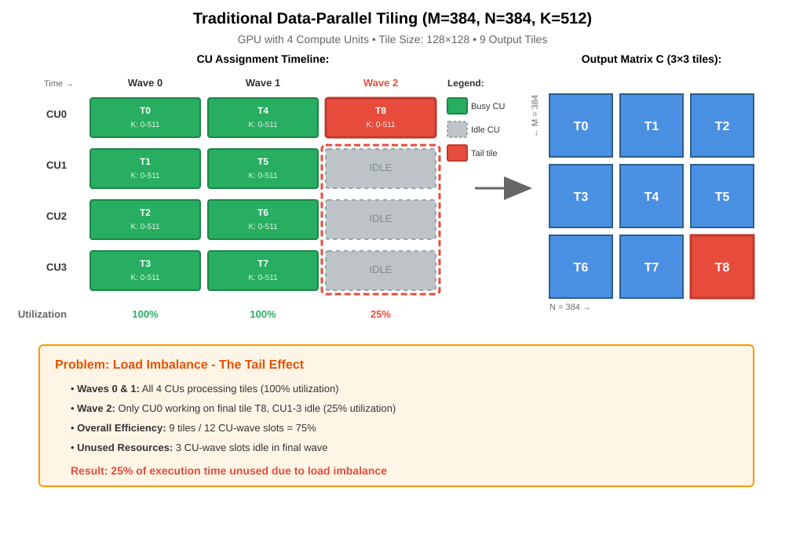
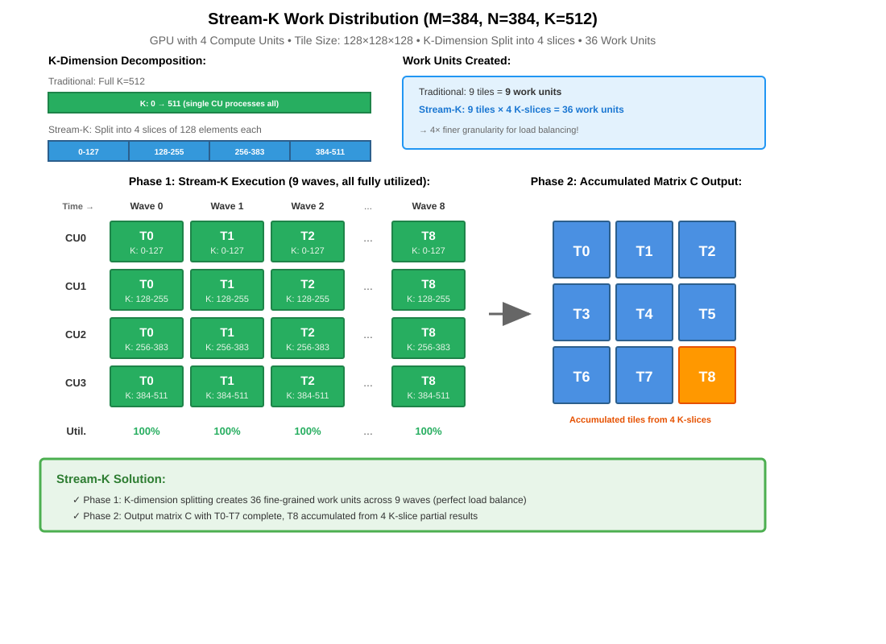

.. _ck_tile_stream_k:

Stream-K Strategy: Executive Summary
=====================================

What is Stream-K?
-----------------

Stream-K is an advanced computational strategy designed to improve the performance of General Matrix Multiply (GEMM) operations on GPUs (Graphics Processing Units). Introduced into AMD's Composable Kernel (CK), Stream-K addresses a critical challenge in modern computing: efficiently distributing work across parallel processors when the workload doesn't divide evenly.

At its core, Stream-K reimagines how matrix multiplication tiles are scheduled across GPU compute units (CUs), replacing traditional data-parallel decomposition with a more flexible streaming approach that dynamically balances computational load.

Traditional Tiling Approach
----------------------------

Before diving into Stream-K, it's important to understand how traditional GPU GEMMs are implemented. A typical GEMM operation C = A × B involves multiplication of input matrices A (M×K), B (K×N), to produce output matrix C (M×N). The computation of the output C can be decomposed into multiple smaller "tiles" of outer products which can then be computed efficiently in parallel. GEMMs on GPU can be parameterized in many different ways to tune performance for a variety of different problem dimensions and conditions. Hyper-parameters in this space may include data types (e.g., fp32, fp16, ...), data layouts (e.g., row major, col major), tile sizes (MxN), thread block sizes, occupancy, data movement pipeline, distribution ordering, etc.

Classical Data-Parallel Tiling
~~~~~~~~~~~~~~~~~~~~~~~~~~~~~~~

In the traditional approach, matrix multiplication is decomposed using a hierarchical tiling strategy:

1. **Output Space Partitioning**: The output matrix C (M×N) is divided into rectangular tiles, typically 128×128 or 256×128 elements
2. **One Tile per Thread Block**: Each GPU thread block is assigned exactly one output tile
3. **Thread Block to CU assignment**: Each GPU thread block is assigned to one CU
4. **Complete K-dimension Processing**: Each thread block performs multiply-accumulation of the outer-product operations of A × B, and iterates through the entire K-dimension to compute its output tile in C
5. **Independent Computation**: Thread blocks work independently with no inter-block communication

Tile Assignment Example
~~~~~~~~~~~~~~~~~~~~~~~

Consider a matrix multiplication with dimensions M=384, N=384, K=512 using 128×128 tiles:

- Output tiles required: ⌈384/128⌉ × ⌈384/128⌉ = 3 × 3 = 9 tiles
- If GPU has 4 compute units available:

  - **Wave 0 and Wave 1**: 4 tiles assigned to 4 CUs (full occupancy)
  - **Wave 2**: 1 tile assigned to 1 CU (3 CUs idle - 75% waste!)

This demonstrates the classic "tail effect" where the final wave has poor CU utilization.

Visualization: Traditional CU Assignment
~~~~~~~~~~~~~~~~~~~~~~~~~~~~~~~~~~~~~~~~~

   Traditional Data-Parallel Tiling - Shows how a 3×3 tile matrix is distributed across 4 compute units, resulting in severe tail effect where Wave 2 has only 25% utilization (1 CU busy, 3 idle). The red tile T8 represents the problematic tail tile that causes load imbalance.

Key Limitations of Traditional Approach
~~~~~~~~~~~~~~~~~~~~~~~~~~~~~~~~~~~~~~~~

1. **Fixed Granularity**: Tile sizes are fixed at compile time (e.g., 128×128), and cannot dynamically adapt to problem dimensions or CU counts
2. **No Work Sharing**: Each CU must complete an entire tile; partial work in the K-dimension cannot be redistributed
3. **Wave Quantization**: GPU schedules work in waves; unfilled waves waste CU resources with idle time
4. **No Load Balancing**: Poor granularity causes some CUs to have magnitudes higher workload than others

Why This Matters
~~~~~~~~~~~~~~~~~

Modern GEMM workloads (e.g., AI transformers, attention mechanisms) frequently encounter:

- Batch size variations (e.g., 1, 3, 7, 13, 17...)
- Sequence length variations (e.g., 77, 197, 384...)
- Hidden dimension sizes (e.g., 768, 1024, 1280...)
- "Difficult" dimension sizes (e.g., small M, N and large K)

These rarely align with perfect tile boundaries, causing persistently poor quantization and underutilization with traditional tiling. Moreover, difficult problem dimensions such as small M, N and large K may cause some CUs to not be assigned any work at all!

How Stream-K Works
------------------

Stream-K employs a sophisticated "streaming" approach that augments traditional (M×N) tiling with a dynamic redistribution of work across the K-dimension of the matrix multiplication. Unlike traditional methods that assign complete M×N tiles to each thread block, Stream-K partitions work along the K-dimension (the reduction dimension) allowing for more granular load balancing.

Core Mechanisms
~~~~~~~~~~~~~~~

1. **K-Dimension Splitting**: Stream-K divides the K-dimension into smaller chunks that can be distributed across multiple compute units. Each CU processes a portion of the K-dimension for a given output tile, with results accumulated through atomic operations or a second reduction phase.

2. **Dynamic Work Distribution**: The tile partitioner calculates optimal work distribution based on:

   - Problem dimensions (M, N, K)
   - Available compute units
   - Tile size configuration
   - Target occupancy and register pressure
   
3. **Two-Phase Execution**:

   - **Phase 1**: CUs process their assigned K-slices independently, writing partial results
   - **Phase 2**: Final reduction combines partial results into complete output tiles

Mathematical Foundation
~~~~~~~~~~~~~~~~~~~~~~~

For a GEMM operation with dimensions M×N×K tiled as (M_tile, N_tile, K_tile):

- **Traditional approach**: ⌈M/M_tile⌉ × ⌈N/N_tile⌉ tiles across M-N plane
- **Stream-K approach**: Distributes ⌈M/M_tile⌉ × ⌈N/N_tile⌉ × ⌈K/K_tile⌉ work units across available CUs

This creates more parallelism opportunities and enables finer-grained load balancing.

Visualization: Stream-K CU Assignment
~~~~~~~~~~~~~~~~~~~~~~~~~~~~~~~~~~~~~~

   Stream-K Work Distribution - Illustrates how Stream-K splits the K-dimension (512) into 4 slices of 128 elements each, creating 36 work units from 9 tiles. These units distribute evenly across 9 waves with 100% CU utilization, completely eliminating the tail effect. The diagram shows K-dimension decomposition, work unit creation, and partial result accumulation for tile T8.

Key Benefits
~~~~~~~~~~~~

- More consistent performance across a wider range of problem sizes
- Better GPU utilization, reducing wasted computational capacity
- Reduces performance cliffs compared to traditional GEMM
- Adapts to different GPU architectures and configurations
- Integrates with existing computational frameworks
- Extracts more value from existing GPU hardware
- Reduces computation time, lowering energy costs
- Enables more work to be completed with the same resources
- Scales well with problem sizes

Implementation in Composable Kernel (CK)
-----------------------------------------

The Stream-K strategy is being integrated into AMD's Composable Kernel library through a comprehensive implementation detailed in the design documentation:

Key Components
~~~~~~~~~~~~~~

**Modular Design**
   Clean integration with existing CK tile operations through template-based abstractions, maintaining compatibility with various data types (FP16, BF16, FP8, BF8, etc.)

**Hybrid Partitioning Strategy**
   The implementation intelligently combines multiple approaches:

   - **Data-parallel tiles**: Traditional fixed-size work chunks assigned to single CUs for the majority of work where load balance is naturally quantized well
   - **Stream-K tiles**: Dynamically-sized work units split across multiple CUs to handle remainder tiles and balance the load in the tail region
   - **Persistent kernel pattern**: Unlike traditional kernels that launch once per tile, Stream-K may use persistent thread blocks that continuously consume work, reducing kernel launch overhead
   - **Thread block to C tile mapping**: Assignment strategy to optimize locality of tile data and maximize cache efficiency.

**Tile Partitioner**
   A sophisticated component (``TilePartitioner_StreamK``) that determines optimal work distribution based on problem geometry and hardware characteristics. It computes:

   - Number of data-parallel vs. Stream-K tiles
   - K-slice boundaries for each compute unit
   - Synchronization points for partial result accumulation
   - Thread block assignment to tiles

**Reduction Strategy**
   Efficient handling of partial sums through workspace allocation and synchronization primitives:

   - **Atomic reduction**: less memory footprint, accumulation using atomic add
   - **Parallel reduction**: partial results written to workspace buffers, which are combined together in a second reduction phase

**Tunable Parameters**
   - Tile size: M×N tile dimensions
   - Block size: The dimensions of the thread block
   - ``kPerBlock``: Amount of K-dimension processed per tile
   - Stream-K split factor: Controls granularity of K-dimension decomposition
   - Occupancy targets: Balances parallelism vs. resource usage
   - Reduction strategy: Atomic or parallel reduction
   - Persistency: Whether thread blocks will exit after one tile or consume multiples
   - Thread block mapping strategy

Comparison with Traditional Approaches
~~~~~~~~~~~~~~~~~~~~~~~~~~~~~~~~~~~~~~~

.. list-table:: Stream-K vs Traditional Data-Parallel
   :header-rows: 1
   :widths: 30 35 35

   * - Aspect
     - Traditional Data-Parallel
     - Stream-K
   * - Work Assignment
     - Fixed M×N tiles
     - Dynamic K-slices
   * - Load Balance
     - Poor with remainder tiles
     - Optimized across all CUs
   * - Synchronization
     - Minimal
     - Requires partial sum accumulation
   * - Best Case
     - Dimensions perfectly divisible
     - All problem sizes
   * - Overhead
     - Low
     - Moderate (sync + workspace)

Stream-K trades modest synchronization overhead for significant gains in CU utilization, yielding net performance improvements for most real-world workloads.

Conclusion
----------

Stream-K is a sophisticated optimization strategy that addresses fundamental challenges in parallel computing on GPU architectures. By intelligently distributing matrix operations across GPU compute units through K-dimension decomposition and hybrid partitioning, it can deliver measurable performance improvements and better hardware utilization in cases with irregular or "difficult" dimensions. 

For organizations dependent on high-performance computing—particularly in AI/ML training, transformer models, and scientific simulation—Stream-K can offer a path to faster computations, lower costs, and more efficient use of GPU resources, squeezing out more performance.
