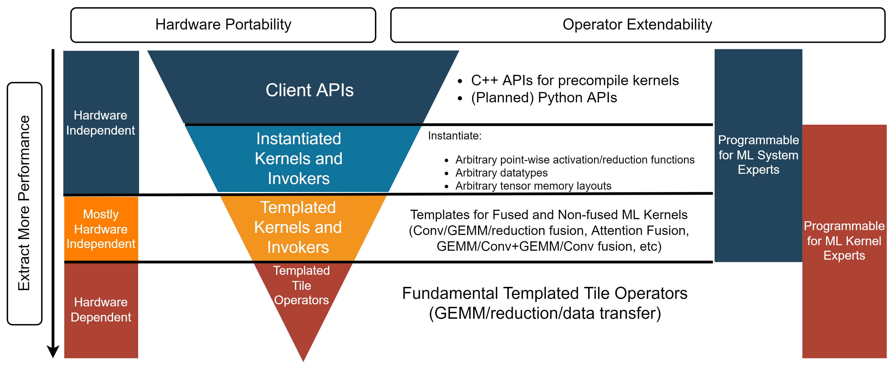

============================
Composable Kernel User Guide
============================

------------
Introduction
------------

This document contains instructions for installing, using, and contributing to Composable Kernel (CK).

-----------
Methodology
-----------

Composable Kernel (CK) library aims to provide a programming model for writing performance critical kernels for machine learning workloads across multiple architectures including GPUs, CPUs, etc, through general purpose kernel languages, like HIP C++.

CK utilizes two concepts to achieve performance portability and code maintainability:

* A tile-based programming model
* Algorithm complexity reduction for complex ML operators, using innovative technique we call "Tensor Coordinate Transformation".

.. image:: data/ck_component.png
   :alt: CK Components

--------------
Code Structure
--------------

Current CK library are structured into 4 layers:

* "Templated Tile Operators" layer
* "Templated Kernel and Invoker" layer
* "Instantiated Kernel and Invoker" layer
* "Client API" layer

   
Documentation Roadmap
^^^^^^^^^^^^^^^^^^^^^
The following is a list of CK documents in the suggested reading order:

.. toctree::
   :maxdepth: 5
   :caption: Contents:
   :numbered:

   tutorial_hello_world
   dockerhub
   Supported_Primitives_Guide
   API_Reference_Guide
   Contributors_Guide
