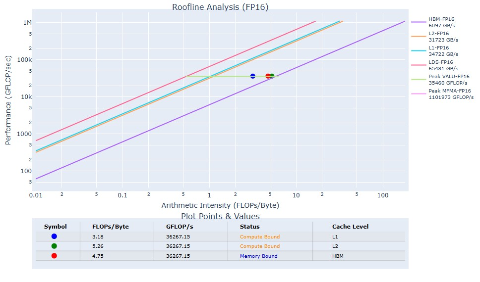
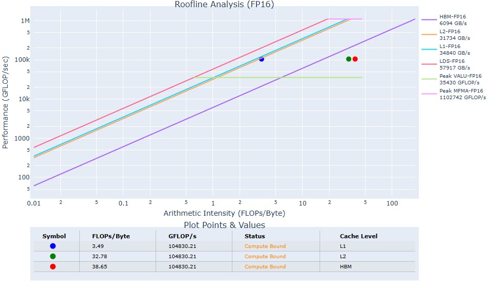

````
 _ __ ___   ___ _ __  _ __ ___  / _|       ___ ___  _ __ ___  _ __  _   _| |_ ___
| '__/ _ \ / __| '_ \| '__/ _ \| |_ _____ / __/ _ \| '_ ` _ \| '_ \| | | | __/ _ \
| | | (_) | (__| |_) | | | (_) |  _|_____| (_| (_) | | | | | | |_) | |_| | ||  __/
|_|  \___/ \___| .__/|_|  \___/|_|        \___\___/|_| |_| |_| .__/ \__,_|\__\___|
               |_|                                           |_|
````

# Installation

Either install using Ubuntu package manager as described in https://rocm.docs.amd.com/projects/rocprofiler-sdk/en/latest/install/installation.html or 
build from source following the instructions from https://github.com/ROCm/rocm-systems/tree/develop/projects/rocprofiler-compute

Building the `rocprof-compute` locally might be preferable to avoid version conflicts between local ROCm stack and 
what `rocprof-compute` expects.

## Local build

If `rocprof-compute` is built locally following the Readme instructions, the binary executable (`rocprof-compute.bin`) is located  
under `/rocm-systems/projects/rocprofiler-compute/build`. One can make alias to local `rocprof-compute` by running

````bash
echo "alias rocprof-compute='~/git/rocm-systems/projects/rocprofiler-compute/build/rocprof-compute.bin'" >> ~/.bashrc
source ~/.bashrc
````

You can verify that `rocprof-compute` points to your local build by running

````bash
rocprof-compute --version
````

# Running the profler step

Run the profiler:

````bash
rocprof-compute profile -n <run_name> -- <executable_to_profile>
````

For grouped convs, I usually use the CK examples to create an entry point to a single kernel. This corresponds to profiling with command

````bash
rocprof-compute profile -n grouped_conv_fwd --roofline-data-type FP16 -- ./bin/example_grouped_conv_fwd_xdl_fp16 0 1 0 2 32 32 4 4 3 3 200 200 1 1 1 1 1 1 1 1
````

If you are runnign e.g. multiple version of the same kernel, make sure that the run name (specified by `-n`) 
is unique. This allows comparison of two runs later in the analysis stage.

It it important set the first and third args to zero. These disable result verification and kernel timing. 
If timig is enabled, the kernel will be run multiple times during a single example run. 
The `rockprof-compute` will internally take care of running the application multiple times to reliable statistics.

The profiling runs are saved by default in directory where the profiler was executed. The parent directory is 
`workloads` which contains all profiler runs in subdirectories corresponding to the run names, e.g., 
the example run is loacted at ``workloads\grouped_conv_fwd`

## Roofline plots

For the roofline plots, we can specify the data type with flag `--roofline-data-type`. 
This flag takes values FP4, FP6, FP8, FP16, BF16, FP32, FP64, I8, I32, I64. 
If the roofline data type is notspecified, it defaults to FP32.

The profiling step can produce a roofline chart to get an idea what is the bottleneck for given kernel and given convolution shape.
The roofline analysis takes into account the various cache level (L1, L2) and the global memory bandwidth.
The roofline plots alone can tell something about the relative performance of kernels.

**Use case**: Consider a grouped fwd conv problem with small number of channels per group and large image.
This is typically a memory bound problem as we can see from this roofline chart



When we combine multiple conv groups into a single GEMM batch, we can do more meaninful compute per tile, 
which moves the problem more into the compute bound regime and improves performance. We can see this directly from the 
profiler roofline charts.



# Running the analysis step

Running the analysis step requires that the data has been collected with the profier step.
To run full analysis, use

````bash
rocprof-compute analyze -p <path-to-profiling-data> --output-format txt --output-name <output-file-name>
````

For example,

````bash
rocprof-compute analyze -p workloads/grouped_conv_fwd/MI350/ --output-format txt --output-name full-analysis
````

This will create a fairly large file that contains all metrics available in `rockprof-compute`. In practice, we
will want to limit to some specific metrics.

## Analyzing specific metrics

To get a list of available metrics for given architecture, use `--list-metrics` flag

````bash
rocprof-compute --list-metrics gfx950
````

This command list all blocks in the analysis, and one limit the analysis to specific blocks for brevity.
To limit the analysis to L1 cache metrics, we run the analysis with only block 13, which corresponds to 
instruction cache

````bash
rocprof-compute analyze -p workloads/grouped_conv_fwd/MI350/ --output-format txt --output-name L1-cache-analysis -b 13
````

## Analyzing two different implementations

One of the most useful features of `rockprof-compute` is the ability to analyze two different implementations 
side-by-side. Assuming we have two implementation that we have profiling and we want to know how they compare 
against each other, we can run the analysis as follows

````bash
rocprof-compute analyze -p <path-to-baseline> -p <path-to-current-impl>
````

This allows to compare the baseline implementation agains a new implementation. 
Running the full analysis allowos to investigate what metrics are changed, and which direction.
The profiler reports absolute differences agains the baseline (first argument), which can be 
used to determine where two implementations differ the most.


To compare our two different conv implementations in terms of L1 cache efficiency, we can run

```bash
rocprof-compute analyze -p workloads/no_group_merge/MI350/ -p workloads/8_group_merged/MI350/ -b 13 --output-format txt --output-name L1-cache-comparison
```

For LDS utilization and statistics, we can use 

```bash
rocprof-compute analyze -p workloads/no_group_merge/MI350/ -p workloads/8_group_merged/MI350/ -b 12 --output-format txt --output-name LDS-comparison
```