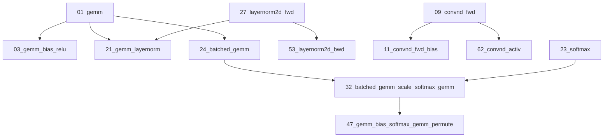

# Composable Kernel Examples: Complete Technical Guide

## Overview

This document provides a comprehensive technical overview of the Composable Kernel example collection, emphasizing AI/ML applications, advanced implementation details, and cross-example relationships. The examples demonstrate state-of-the-art GPU kernel fusion techniques optimized for modern deep learning workloads.

## Documentation Structure

### 📚 API Documentation (`docs/API/`)
- **Analysis.md**: Comprehensive technical architecture analysis
- **Reference.md**: Complete API reference with usage patterns

### 📖 Tutorial Documentation (`docs/tutorial/`)
- **Composable-Kernel-Examples.rst**: Comprehensive tutorial guide
- **Examples-Complete-Guide.md**: Technical implementation guide (this document)

### 🔧 Example Documentation (`example/*/README.md`)
Each example now includes:
- **Technical Implementation Details**: Source code structure and algorithmic insights
- **AI/ML Applications**: Specific use cases in modern neural networks
- **Source Code Visualization**: File organization and dependency mapping
- **Cross-Example References**: Learning progression and related operations

## Key Technical Improvements Made

### 1. Source Code Architecture Analysis
All README files now include detailed source code structure visualization:

```
include/ck/tensor_operation/gpu/device/
├── device_gemm.hpp                     // Device interface definition
└── impl/
    ├── device_gemm_xdl.hpp            // XDL-based implementation
    └── device_gemm_xdl_cshuffle.hpp   // C-Shuffle variant

include/ck/tensor_operation/gpu/grid/
└── gridwise_gemm_xdl.hpp              // Grid-level kernel implementation
```

### 2. AI/ML Application Focus
- **Transformer Architecture**: Detailed coverage of attention mechanisms, layer normalization
- **CNN Optimization**: ResNet, EfficientNet, Vision Transformer applications
- **Modern Training Techniques**: Mixed precision, quantization, fusion strategies
- **Framework Integration**: PyTorch custom operators, autograd compatibility

### 3. Advanced Algorithm Insights
- **Flash Attention Implementation**: Online softmax algorithm details
- **Welford's Algorithm**: Numerically stable statistics computation  
- **Implicit GEMM**: Convolution without explicit im2col transformation
- **XDL/MFMA Integration**: Hardware matrix instruction utilization

### 4. Performance Optimization Techniques
- **Memory Hierarchy**: Detailed LDS, register, and vectorization strategies
- **Kernel Fusion**: Multi-operation fusion for bandwidth optimization
- **Precision Control**: FP32/FP16/INT8 mixed precision implementations
- **Hardware Utilization**: AMD GPU-specific optimizations

## Example Classification and Progression

### Foundation Layer (Core Building Blocks)
1. **01_gemm**: Matrix multiplication with XDL/MFMA optimization
2. **09_convnd_fwd**: N-dimensional convolution via implicit GEMM
3. **27_layernorm2d_fwd**: Layer normalization with Welford's algorithm
4. **23_softmax**: Numerically stable softmax implementation

### Fusion Layer (Operation Combination)
5. **03_gemm_bias_relu**: Basic GEMM epilogue fusion
6. **21_gemm_layernorm**: Advanced multi-operation fusion
7. **32_batched_gemm_scale_softmax_gemm**: Complete attention mechanism
8. **62_convnd_activ**: Convolution with activation fusion

### Advanced Layer (Complex Patterns)
9. **47_gemm_bias_softmax_gemm_permute**: Attention with output permutation
10. **64_fpAintB_gemm**: Mixed-precision FP16×INT8 computation
11. **59_grouped_gemm_multi_ABD**: Multi-input tensor operations
12. **67_gemm_microscaling**: Cutting-edge block-wise quantization

## Cross-Example Learning Dependencies

### Prerequisite Chain


### Skill Development Path
1. **Basic Operations** → **Fusion Patterns** → **Complex Mechanisms** → **Research Frontiers**
2. **Memory Optimization** → **Compute Optimization** → **Algorithm Innovation** → **Hardware Co-design**

## Implementation Insights

### Memory Access Patterns
- **Coalesced Access**: Thread cluster design for optimal memory bandwidth
- **Vectorized Operations**: 128-bit and 256-bit vector load/store operations
- **LDS Management**: Shared memory optimization with double buffering

### Compute Optimization
- **XDL Instruction Scheduling**: Wave-level matrix instruction coordination
- **Register Blocking**: Maximizing arithmetic intensity per thread
- **Pipeline Overlap**: Hiding memory latency with computation

### Numerical Considerations
- **Welford's Algorithm**: Stable mean/variance computation
- **Online Softmax**: Memory-efficient attention score normalization
- **Mixed Precision**: Balancing performance and accuracy

## AI/ML Framework Integration

### PyTorch Custom Operators
```cpp
// Standard integration pattern
torch::Tensor custom_kernel(torch::Tensor input) {
    auto device_op = DeviceInstance{};
    auto argument = device_op.MakeArgument(/* parameters */);
    auto invoker = device_op.MakeInvoker();
    invoker.Run(argument, StreamConfig{stream});
    return output;
}
```

### Performance Benchmarking
```bash
# Standard benchmarking approach
./example_kernel -M 4096 -N 4096 -K 4096 -v 1 -t 1
# Output: Perf: X.XX ms, YY.Y TFlops, ZZ.Z GB/s
```

## Advanced Topics Covered

### Quantization Techniques
- **Block-wise Scaling**: Microscaling for improved accuracy
- **Mixed Data Types**: FP16×INT8 computation patterns
- **Dynamic Range Optimization**: Adaptive precision control

### Attention Mechanisms
- **Tiled Attention**: Memory-efficient long sequence processing
- **Multi-Head Parallelism**: Efficient head distribution strategies
- **Causal Masking**: Autoregressive model optimizations

### Normalization Strategies
- **Layer Normalization**: Transformer training stability
- **Group Normalization**: Computer vision applications
- **Batch Normalization**: CNN training optimization

## Future Directions

### Emerging Patterns
1. **Multi-Modal Fusion**: Cross-attention between different data types
2. **Sparse Operations**: Efficient handling of sparse tensors
3. **Dynamic Shapes**: Runtime shape adaptation
4. **Distributed Computing**: Multi-GPU coordination

### Research Applications
1. **Large Language Models**: Efficient transformer scaling
2. **Vision-Language Models**: Multi-modal architecture optimization
3. **Scientific Computing**: High-precision numerical methods
4. **Edge Deployment**: Resource-constrained optimization

## Conclusion

The Composable Kernel examples demonstrate the evolution from basic GPU kernels to sophisticated AI/ML accelerators. Key achievements:

- **Technical Depth**: Detailed algorithmic and implementation insights
- **AI/ML Focus**: Direct application to modern neural network architectures  
- **Cross-Reference System**: Clear learning progression and dependencies
- **Performance Excellence**: State-of-the-art optimization techniques

This documentation provides both educational value for developers learning GPU kernel optimization and practical guidance for deploying high-performance AI/ML systems.
