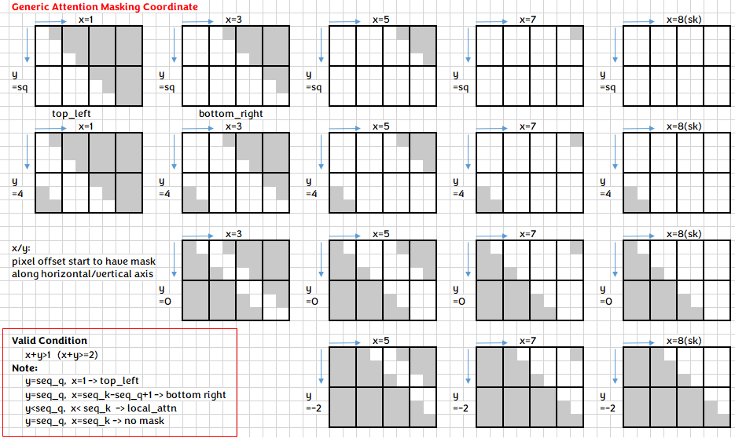

# fused multi-head attention

This folder contains example for fmha(fused multi-head attention) using ck_tile tile-programming implementation. It is a good example to demonstrate the usage of tile-programming API, as well as illustrate the new approach to construct a kernel template and instantiate it(them) while keeping compile time fast.

## build
```
# in the root of ck_tile
mkdir build && cd build
sh ../script/cmake-ck-dev.sh  ../ <arch>  # you can replace this <arch> to gfx90a, gfx942...
make tile_example_fmha_fwd -j
```
This will result in an executable `build/bin/tile_example_fmha_fwd`

## kernel
The kernel template is `fmha_fwd_kernel.hpp`, this is the grid-wise op in old ck_tile's terminology. We put it here purposely, to demonstrate one can construct a kernel by using various internal component from ck_tile. We may still have an implementation under ck_tile's include path (in the future) for the kernel template.

There are 3 template parameters for this kernel template.
* `TilePartitioner` is used to map the workgroup to corresponding tile, `fmha_fwd_tile_partitioner.hpp` in this folder served as this purpose.
* `FmhaPipeline` is one of the block_tile_pipeline(under `include/ck_tile/tile_program/block_tile_pipeline`) which is a performance critical component. Indeed, we did a lot of optimization and trials to optimize the pipeline and may still workout more performance pipeline and update into that folder. People only need to replace this pipeline type and would be able to enjoy the benefit of different performant implementations (stay tuned for updated pipeline(s)).
* `EpiloguePipeline` will modify and store out the result in the last phase. People usually will do lot of post-fusion at this stage, so we also abstract this concept. Currently we didn't do much thing at the epilogue stage but leave the room for future possible support.

## codegen
To speed up compile time, we instantiate the kernels into separate file. In this way we can benefit from parallel building from CMake/Make system. This is achieved by `generate.py` script. Besides, you can look into this script to learn how to instantiate a kernel instance step by step, which is described in `FMHA_FWD_KERNEL_BODY` variable.

## executable
`tile_example_fmha_fwd` is the example executable, implemented in `fmha_fwd.cpp`. You can type `./bin/tile_example_fmha_fwd -?` to list all supported args. Below is an example of the output (may subject to change)
```
args:
          -v    weather do CPU validation or not (default:1)
       -mode    kernel mode. 0:batch, 1:group (default:0)
          -b    batch size (default:2)
          -h    num of head, for q (default:8)
        -h_k    num of head, for k/v, -1 means equal to h (default:-1)
                 if not equal to h, then this is GQA/MQA case
          -s    seqlen_q. if group-mode, means the average value of seqlen_q (default:3328)
                 total_seqlen_q = seqlen_q * batch, and seqlen_q per batch may vary
                 also with "-s=s0,s1,s2..." comma seperated int to set per batch seqlen(group-mode)
        -s_k    seqlen_k, -1 means equal to s (default:-1)
          -d    head dim for q, k (default:128)
        -d_v    head dim for v, -1 means equal to d (default:-1)
    -scale_s    scale factor of S. 0 means equal to 1/sqrt(hdim). (default:0)
                 note when squant=1, this value will be modified by range_q/k
    -range_q    per-tensor quantization range of q. used if squant=1. (default:16)
    -range_k    per-tensor quantization range of k. used if squant=1. (default:16)
    -range_v    per-tensor quantization range of v. used if squant=1. (default:16)
    -range_p    per-tensor quantization range of p [e^(s-m)]. used if squant=1. (default:1)
    -range_o    per-tensor quantization range of o (p*v). used if squant=1. (default:16)
     -squant    if using static quantization fusion or not. auto: fp8 will default use squant, other will not (default:auto)
                 0: no static quant(not implemented) 1: apply scale_p and scale_o with respect to P and O.
                 calculate scale_s, scale_p, scale_o according to range_q, range_k, range_v, range_p, range_o
      -iperm    permute input (default:1)
                 if true, will be b*h*s*d, else b*s*h*d
      -operm    permute output (default:1)
       -bias    n or 0, no bias (default:n)
                 e(lementwise) or 1, elementwise bias with 1*1*s*s. e:1, 1*h*s*s. e:2, b*h*s*s
                 a(libi) or 2, alibi with 1*h. a:1, b*h
       -prec    data type. fp16/bf16/fp8/bf8 (default:fp16)
       -mask    0: no mask, 1: top-left(same as 't'), 2:bottom-right(same as 'b') (default:0)
                 't', top-left causal mask, 'b', bottom-r causal mask
                 't:l,r', top-left sliding window attn(swa) with FA style left right size
                 'b:l,r', bottom-r sliding window attn(swa) with FA style left right size
                 'xt:window_size', xformer style masking from top-left, window_size negative is causal, positive is swa
                 'xb:window_size', xformer style masking from bottom-r, window_size negative is causal, positive is swa
                 'g:y,x', generic attention mask coordinate with y/x size (only debug purpose for now)
    -vlayout    r for row-major(seqlen*hdim), c for col-major(hdim*seqlen) (default:r)
        -lse    0 not store lse, 1 store lse (default:0)
      -kname    if set to 1 will print kernel name (default:0)
       -init    init method. ui, uniform random int, ni, normalized random int (default:uf)
                 uf, uniform random float, nf, normalized random float, tf, trig float, uf:q, quantization
       -seed    random seed used for initializing input tensors. 0 for non-deterministic seed (default:11939)
     -warmup    number of iterations before benchmark the kernel (default:5)
     -repeat    number of iterations to benchmark the kernel (default:20)
```
Example: `./bin/tile_example_fmha_fwd -b=1 -h=16 -s=16384 -d=128` will run a fmha case with batch=1, nhead=16, sequence length=16384, hdim=128, fp16 case.

## support features
Currently we are still in rapid development stage, so more features/optimizations will be coming soon.

### hdim
Currently we support `32/64/128/256` hdim for `fp16`/`bf16`, within which `64`/`128` is better optimized. hdim should be multiple of 8, while seqlen_s can be arbitrary. For hdim be arbitrary number, it can be support through padding kernel of `qr` pipeline (we didn't generate this in generate.py by default)

### group/batch mode
Currently we support both `batch mode` and `group mode` (or `varlen`, in FA's term), by setting `-mode` = `0` or `1`. In `group mode` different kind of attention mask is also supported(see below)

### MQA/GQA
By setting `-h`(nhead for q) and `-h_k`(nhead for k/v) with different number, you can achieve MQA/GQA. Please pay attention that `h % h_K == 0` when you set different numbers.

### input/output permute, and `b*s*3*h*d`
If you look at the kernel argument inside `fmha_fwd_kernel.hpp`, we support providing arbitrary stride for seqlen(stride_q/k/v), nhead, batch of q/k/v matrix, hence it is very flexible to support `b*h*s*d` or `b*s*h*d` input/output permute. The `-iperm=0/1`, `-operm=0/1` is a convenient way to achieve this through the executable. We didn't provide a command-line arg to test `b*s*3*h*d` layout which is by default used by torch/FA, but it's trivial to achieve this if one set the proper `stride_q/k/v` value as `3*h*d`.

### attention bias
Attention bias is supported with the layout of `1*1*s*s`(similiar to input/output, different layout can be supported by changing the stride value for bias, or even extend to `b*h*s*s`) and bias value in float number.

### alibi
alibi is supported

### lse
For training kernels, "log sum exp" need to store out in forward and used in backward. We support this by setting `-lse=1`

### vlayout
We support v matrix in both row-major(`seqlen*hdim`) and col-major(`hdim*seqlen`). Since the accumulate(reduce) dimension for V is along `seqlen`, for current AMD's mfma layout which expect each thread to have contiguous register holding pixels along reduce dimension, it's easier to support col-major V layout. However, the performance of col-major is not necessarily faster than row-major, there are many factors that may affect the overall performance. We still provide the `-vlayout=r/c` here to switch/test between different layouts.

### attention mask
we support `causal mask` and `sliding window attention(swa)` mask in both batch and group mode, either from top-left or bottom-right.
Underneath, we unify the mask expression into `generic attention mask coordinate`, providing an uniformed approach for each batch to locate the corresponding pixel need to be masked out.


Since FA/xformer style with window_size_left/right is more popular, we accept window_size as parameter and convert that internally to our generic coordinate(this coordinate can express more cases). Below shows some example of how to achieve different kind of mask through cmdline.

| mask case|  cmdline    | FA style | xformer style |
|----------|:-------------:|:-------------:|:-------------:|
| no mask |  `-mask=0`(default) | | |
| causal mask from top-left | `-mask=1` or `-mask=t` | `-mask=t:-1,0` | `-mask=xt:-1` |
| causal mask from bottom-right | `-mask=2` or `-mask=b` | `-mask=b:-1,0` | `-mask=xb:-1` |
| swa from top-left | | `-mask=t:3,5` | `-mask=xt:4` |
| swa from bottom-right | |  `-mask=b:10,11` | `-mask=xb:16` |

Note FA use bottom-right by default to express swa case, here we require you explicitly specify top-left/bottom-right.

### dropout
TBD

## FP8 experimental support
As described in [this blog](https://blog.hippoml.com/8bit-hippoattention-up-to-3x-faster-compared-to-flashattentionv2-8f9def90b482), we have an experimental support for fp8 fmha kernels, you can evaluate the performance by setting the arg `-prec=fp8` to the `tile_example_fmha_fwd`, on a gfx940/941/942 machine and ROCm 6.0+.

Currently we only support `-vlayout=c`( `hdim*seqlen` for V matrix) and `-squant=1`(static quantization) with `hdim=128` for fp8 now. Full feature support will come later.
