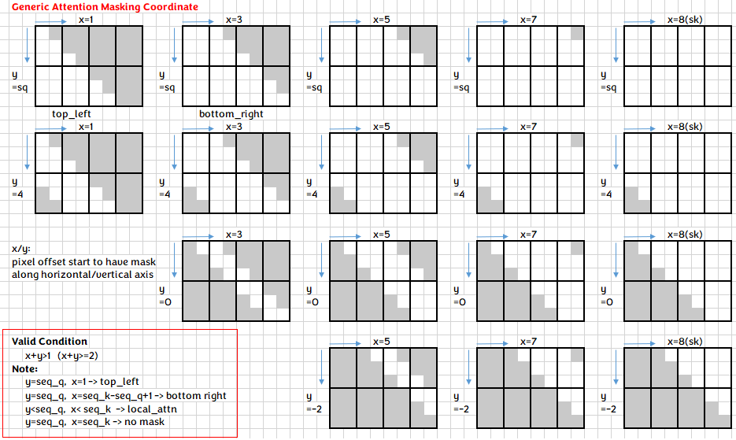

# fused multi-head attention

This folder contains example for fmha(fused multi-head attention) using ck_tile tile-programming implementation. It is a good example to demonstrate the usage of tile-programming API, as well as illustrate the new approach to construct a kernel template and instantiate it(them) while keeping compile time fast.

## build
```
# 1. In the root of composable_kernel project, create the build directory.
[~/composable_kernel] mkdir build && cd build
# 2. In the build directory, run the CMake wrapper script to generate the build system files. Replace <arch> with the gfx architectures string.
[~/composable_kernel/build] ../script/cmake-ck-dev.sh .. <arch> -G Ninja
# 3. In the build directory, run the build system recipe.
[~/composable_kernel/build] ninja tile_example_fmha_fwd
```
Running the build recipe will produce the executable `tile_example_fmha_fwd`.

The executables reside in `bin` subdirectory of the build directory.

This example provides recipes for `tile_example_fmha_fwd`, `tile_example_fmha_bwd`.

> [!NOTE]
> `cmake-ck-dev.sh` is a CMake wrapper.
>
> The first argument is the path to composable_kernel sources.
>
> The second argument is the gfx architectures string (e.g. "gfx950" or "gfx90a;gfx942").
>
> The remaining arguments are optional and are passed through to CMake.
> E.g. `-G Ninja` specifies ninja as the build system.

## kernel
The kernel template is `fmha_fwd_kernel.hpp`, this is the grid-wise op in old ck_tile's terminology. We put it here purposely, to demonstrate one can construct a kernel by using various internal component from ck_tile. We may still have an implementation under ck_tile's include path (in the future) for the kernel template.

There are 2 template parameters for this kernel template.
* `FmhaPipeline` is one of the block_tile_pipeline(under `include/ck_tile/tile_program/block_tile_pipeline`) which is a performance critical component. Indeed, we did a lot of optimization and trials to optimize the pipeline and may still workout more performance pipeline and update into that folder. People only need to replace this pipeline type and would be able to enjoy the benefit of different performant implementations (stay tuned for updated pipeline(s)).
* `EpiloguePipeline` will modify and store out the result in the last phase. People usually will do lot of post-fusion at this stage, so we also abstract this concept. Currently we didn't do much thing at the epilogue stage but leave the room for future possible support.

## codegen
To speed up compile time, we instantiate the kernels into separate file. In this way we can benefit from parallel building from CMake/Make system. This is achieved by `generate.py` script. Besides, you can look into this script to learn how to instantiate a kernel instance step by step, which is described in `FMHA_FWD_KERNEL_BODY` variable.

## executable
`tile_example_fmha_fwd` is the example executable, implemented in `fmha_fwd.cpp`. You can type `./bin/tile_example_fmha_fwd -?` to list all the arguments. Below is an example of the output (may subject to change)
```
args:
          -v    weather do CPU validation or not (default:1)
       -mode    kernel mode. 0:batch, 1:group (default:0)
          -b    batch size (default:2)
          -h    num of head, for q (default:8)
        -h_k    num of head, for k/v, -1 means equal to h (default:-1)
                if not equal to h, then this is GQA/MQA case
          -s    seqlen_q. if group-mode, means the average value of seqlen_q (default:3328)
                total_seqlen_q = seqlen_q * batch, and seqlen_q per batch may vary
                also with "-s=s0,s1,s2..." comma seperated int to set per batch seqlen(group-mode)
        -s_k    seqlen_k (including new key/value), -1 means equal to s (default:-1)
                also with "-s_k=s0,s1,s2..." comma-separated ints to set seqlen per batch (group mode)
     -s_qpad    seqlen_q stride between 2 batches (group-mode optional) (default:-1)
                Provide positive strides per-batch to simulate physical padding on Q
     -s_kpad    seqlen_k stride between 2 batches, currently used in group-mode only  (default:-1)
                for kv-cache case, each batch [1,s,h,d]/[1,h,s,d] can have a stride
                along seqlen, instead of packed, same as xformer kv_padding,
                must be greater than or equal to s_k
          -d    head dim for q, k (default:128)
        -d_v    head dim for v, -1 means equal to d (default:-1)
    -scale_s    scale factor of S. 0 means equal to 1/sqrt(hdim). (default:0)
     -qscale    n or 0, no scaling (default:n)
                pt or 1, per-tensor scale
                bs or 2, block scale
                kvbs or 3, Q per-tensor, K/V per-page block scale, only in batch_prefill
                mx or 4, microscaling (exclusively for mxfp8/mxfp4)
                ph or 5, per-head scale
      -iperm    permute input (default:1)
                if true, will be b*h*s*d, else b*s*h*d
      -operm    permute output (default:1)
       -bias    n or 0, no bias (default:n)
                e(lementwise) or 1, elementwise bias with 1*1*s*s. e:1, 1*h*s*s. e:2, b*h*s*s
                a(libi) or 2, alibi with 1*h. a:1, b*h
       -prec    data type. fp32/fp16/bf16/fp8/fp8bf16/fp8fp32/mxfp8/mxfp4 (default:fp16)
       -mask    0: no mask, 1: top-left(same as 't'), 2:bottom-right(same as 'b') (default:0)
                't', top-left causal mask, 'b', bottom-r causal mask
                't:l,r', top-left sliding window attn(swa) with FA style left right size
                'b:l,r', bottom-r sliding window attn(swa) with FA style left right size
                'xt:window_size', xformer style masking from top-left, window_size negative is causal, positive is swa
                'xb:window_size', xformer style masking from bottom-r, window_size negative is causal, positive is swa
                'g:y,x', generic attention mask coordinate with y/x size (only debug purpose for now)
    -vlayout    r for row-major(seqlen*hdim), c for col-major(hdim*seqlen) (default:r)
        -lse    0 not store lse, 1 store lse (default:0)
      -kname    if set to 1 will print kernel name (default:0)
       -init    init method. ui, uniform random int, ni, normalized random int (default:uf)
                uf, uniform random float, nf, normalized random float, tf, trig float, uf:q, quantization
       -seed    random seed used for initializing input tensors. 0 for non-deterministic seed (default:11939)
  -drop_seed    seed for random number generator (default:1)
-drop_offset    offset for random number generator (default:0)
 -drop_prefs    seed and offset values are present on GPU; 0 - host, 1 - device/GPU (default:0)
 -num_splits    number of splits for key/value. 0 to determine actual number by heuristic (default:1)
     -warmup    number of iterations before benchmark the kernel (default:5)
     -repeat    number of iterations to benchmark the kernel (default:20)
       -json    0: No Json, 1: Dump Results in Json format (default:0)
   -jsonfile    json file name to dump results (default:fmha_fwd.json)
 -q_eff_lens    Batch-mode only: per-batch effective seqlen for Q (exclude PAD) (default:"")
                Comma-separated list of length 'b'. If empty, no override
-kv_eff_lens    Batch-mode only: per-batch effective seqlen for KV (exclude PAD) (default:"")
                Comma-separated list of length 'b'. If empty, no override
```
Example 1: `./bin/tile_example_fmha_fwd -b=1 -h=16 -s=16384 -d=128` will run a fmha case with batch=1, nhead=16, sequence length=16384, hdim=128, fp16 case.
Example 2: `./bin/tile_example_fmha_fwd -b=1 -h=8 -s=16384 -d=64 -drop_prefs=1 -drop_seed=10 -drop_offset=1234` will run a fmha case with
  batch=1, nhead=8, sequence length=16384, hdim=64, drop_seed=0 (in GPU memory), drop_offset=1234 (in GPU memory) fp16 case

## Padding Examples
Example 3 (Group mode with padding): `./bin/tile_example_fmha_fwd -mode=1 -b=2 -h=8 -s=1024,2048 -s_k=1024,2048 -s_qpad=1536,3072 -s_kpad=1536,3072 -d=128` will run group mode with 2 batches having different sequence lengths (1024, 2048) but physically padded to (1536, 3072) respectively.

Example 4 (Batch mode with effective lengths): `./bin/tile_example_fmha_fwd -mode=0 -b=2 -h=8 -s=2048 -s_k=2048 -d=128 -q_eff_lens=1024,1536 -kv_eff_lens=1024,1536` will run batch mode where all batches use 2048 as physical sequence length but have effective lengths of (1024, 1536) for Q and KV respectively.

## support features
Currently we are still in rapid development stage, so more features/optimizations will be coming soon.

### hdim
Currently we support `32/64/128/256` hdim for `fp16`/`bf16`, within which `64`/`128` is better optimized. hdim should be multiple of 8, while seqlen_s can be arbitrary. For hdim be arbitrary number, it can be support through padding kernel of `qr` pipeline (we didn't generate this in generate.py by default)

### group/batch mode
Currently we support both `batch mode` and `group mode` (or `varlen`, in FA's term), by setting `-mode` = `0` or `1`. In `group mode` different kind of attention mask is also supported(see below)

### MQA/GQA
By setting `-h`(nhead for q) and `-h_k`(nhead for k/v) with different number, you can achieve MQA/GQA. Please pay attention that `h % h_K == 0` when you set different numbers.

### input/output permute, and `b*s*3*h*d`
If you look at the kernel argument inside `fmha_fwd_kernel.hpp`, we support providing arbitrary stride for seqlen(stride_q/k/v), nhead, batch of q/k/v matrix, hence it is very flexible to support `b*h*s*d` or `b*s*h*d` input/output permute. The `-iperm=0/1`, `-operm=0/1` is a convenient way to achieve this through the executable. We didn't provide a command-line arg to test `b*s*3*h*d` layout which is by default used by torch/FA, but it's trivial to achieve this if one set the proper `stride_q/k/v` value as `3*h*d`.

### attention bias
Attention bias is supported with the layout of `1*1*s*s`(similiar to input/output, different layout can be supported by changing the stride value for bias, or even extend to `b*h*s*s`) and bias value in float number.

### alibi
alibi is supported

### lse
For training kernels, "log sum exp" need to store out in forward and used in backward. We support this by setting `-lse=1`

### vlayout
We support v matrix in both row-major(`seqlen*hdim`) and col-major(`hdim*seqlen`). Since the accumulate(reduce) dimension for V is along `seqlen`, for current AMD's mfma layout which expect each thread to have contiguous register holding pixels along reduce dimension, it's easier to support col-major V layout. However, the performance of col-major is not necessarily faster than row-major, there are many factors that may affect the overall performance. We still provide the `-vlayout=r/c` here to switch/test between different layouts.

### attention mask
we support `causal mask` and `sliding window attention(swa)` mask in both batch and group mode, either from top-left or bottom-right.
Underneath, we unify the mask expression into `generic attention mask coordinate`, providing an uniformed approach for each batch to locate the corresponding pixel need to be masked out.


Since FA/xformer style with window_size_left/right is more popular, we accept window_size as parameter and convert that internally to our generic coordinate(this coordinate can express more cases). Below shows some example of how to achieve different kind of mask through cmdline.

| mask case|  cmdline    | FA style | xformer style |
|----------|:-------------:|:-------------:|:-------------:|
| no mask |  `-mask=0`(default) | | |
| causal mask from top-left | `-mask=1` or `-mask=t` | `-mask=t:-1,0` | `-mask=xt:-1` |
| causal mask from bottom-right | `-mask=2` or `-mask=b` | `-mask=b:-1,0` | `-mask=xb:-1` |
| swa from top-left | | `-mask=t:3,5` | `-mask=xt:4` |
| swa from bottom-right | |  `-mask=b:10,11` | `-mask=xb:16` |

Note FA use bottom-right by default to express swa case, here we require you explicitly specify top-left/bottom-right.

### dropout
TBD

### sequence padding and variable length support
We support sequence padding and variable-length processing in both batch and group modes fmha forward to handle real-world scenarios where sequences have different lengths.

**Group Mode Padding**: Use `-s_qpad` and `-s_kpad` to specify physical stride between batches, enabling padded layouts. Each batch can have different logical sequence lengths (`-s`, `-s_k`) but use larger physical strides for memory alignment.

**Batch Mode Variable Length**: Use `-q_eff_lens` and `-kv_eff_lens` to specify effective sequence lengths per batch. All batches share the same physical sequence length, but the kernel processes only the effective portions. This enables efficient variable-length attention without memory waste.

Both approaches optimize memory access patterns while supporting flexible sequence length requirements commonly found in transformer inference scenarios.

## FP8 support
FP8 FMHA kernels are supported on gfx942/gfx950/gfx1250 machines with ROCm 6.0+. Three fp8-based precision modes are available via `-prec`:

| `-prec` value | Q/K/V input type | Output type | Description |
|---|---|---|---|
| `fp8` | fp8 | fp8 | Fully fp8: both inputs and output are in fp8 |
| `fp8bf16` | fp8 | bf16 | Mixed precision: fp8 inputs, bf16 output — useful when the consumer expects a wider-range output format |
| `fp8fp32` | fp8 | fp32 | Mixed precision: fp8 inputs, fp32 output — highest-precision output, suitable for debugging or further fp32 processing |

The following quantization scale modes are available via `-qscale`:

| `-qscale` value | Description |
|---|---|
| `n` or `0` | No quantization scale (default) |
| `pt` or `1` | Per-tensor quantization scale — a single scale factor is applied to the entire tensor |
| `bs` or `2` | Per-block quantization scale — a scale factor is applied per block of elements |
| `kvbs` or `3` | Q per-tensor + K/V per-page block scale (batch_prefill only) |
| `mx` or `4` | Microscaling (MX format), exclusively for `mxfp8` and `mxfp4` data types |
| `ph` or `5` | Per-head quantization scale — one scale factor per (batch, head) |

Currently only `-vlayout=r` (`seqlen*hdim` for V matrix) is supported for fp8 data types.

### V scale with `bs` on gfx1250

The V scale must be a **power of two**. It rides an E8M0 scale operand and is truncated toward
zero, so `1.9` is applied as `1.0`.

Round the V scale up to a power of two **at quantization time** and quantize with that same
value. This is not checked at runtime.

## backward

`tile_example_fmha_bwd` is the training-side example, implemented in `example_fmha_bwd.cpp`.
Build it with `ninja tile_example_fmha_bwd`. Given `Q`, `K`, `V`, the forward output `O` and the
forward `LSE`, it produces `dQ`, `dK`, `dV` (and optionally `dBias`) from an incoming `dO`.

### kernels

One backward call launches two or three kernels:

| kernel | what it does |
|---|---|
| `fmha_bwd_dot_do_o` | `D[q] = rowsum(dO[q,:] * O[q,:])`, the softmax-Jacobian correction term. Also accumulates the sink gradient when enabled. |
| `fmha_bwd_dq_dk_dv` | the main loop: recompute `P = exp(S - LSE)`, then `dV = P^T dO`, `dP = dO V^T`, `dS = P * (dP - D)`, `dK = scale * dS^T Q`, `dQ = scale * dS K` |
| `fmha_bwd_convert_dq` | converts the fp32 `dq_acc` scratch to the output type |

`P` is never stored by the forward kernel. It is recomputed from `S` and the saved `LSE`, which is
exact rather than approximate: `LSE >= rowmax`, so `exp(S - LSE)` cannot overflow, and the row-max
term that online softmax subtracted in the forward pass cancels.

The third kernel exists because most pipelines split the grid along `seqlen_k`. Each block then
owns a slice of the sum that forms `dQ`, so partial results are accumulated into an fp32 `dq_acc`
workspace with `buffer_atomic_add_f32` and converted afterwards. Pipelines that keep `dQ` in
registers for the whole `K` loop (the decode pipeline, `seqlen_q <= 32`) finish `dQ` in place and
skip both the workspace and the convert kernel.

### executable

`./bin/tile_example_fmha_bwd -?` lists every argument. The shape, layout, mask, bias and dropout
arguments match `tile_example_fmha_fwd`, with these differences:

| difference | detail |
|---|---|
| `-scale` | named `-scale_s` in the forward example |
| `-dbias` | `1` also produces the bias gradient (requires elementwise bias) |
| `-p_drop` | dropout probability; the forward example has no dropout argument |
| `-deterministic` | `1` reduces `dQ` through per-block buffers instead of atomics, making the result bit-reproducible |
| `-sink_grad` | `1` computes and validates the attention-sink gradient (see below) |
| absent | `-vlayout`, `-lse`, `-qscale`, `-num_splits`, `-q_eff_lens`, `-kv_eff_lens` |

Example 1: `./bin/tile_example_fmha_bwd -b=1 -h=16 -s=4096 -d=128` runs batch mode, nhead=16,
seqlen 4096, hdim 128, fp16.

Example 2: `./bin/tile_example_fmha_bwd -mode=1 -b=2 -h=8 -h_k=2 -s=1024,2048 -d=64 -mask=1`
runs group mode with GQA (8 query heads over 2 kv heads), per-batch seqlens, and a top-left causal
mask.

### attention sink gradient

An attention sink is a learned per-head logit that joins the softmax denominator without
contributing a value vector, so the attention weights over real tokens no longer sum to one. This
is the mechanism used by gpt-oss. Setting `-sink_grad=1` gives every head a sink score and
validates its gradient:

```
P_sink[h,q] = exp(sink[h] - LSE[h,q])
d_sink[h]   = -sum_q P_sink[h,q] * D[h,q]
```

The sum runs over every query row of every batch, so `d_sink` has shape `[nhead]` and is
accumulated with `atomicAdd` from `fmha_bwd_dot_do_o`. Two consequences follow:

- **The caller must zero `d_sink_ptr` before the call.** The kernel only accumulates into it and
  never initialises it.
- `d_sink` is not bit-reproducible across runs even with `-deterministic=1`, because that flag
  controls the `dQ` reduction only.

The `LSE` handed to the backward call must be the **post-sink** `LSE`, that is
`log(exp(LSE_nosink) + exp(sink))`, which is what the forward kernel writes when a sink is
enabled. This matters for fully masked rows: with a sink their `LSE` is `sink` rather than `-inf`,
which is what keeps `exp(sink - LSE)` finite.

A head whose sink score is `-inf` is treated as having no sink and yields a `d_sink` of exactly
zero. This is handled by skipping the head rather than by evaluating the formula, because a fully
masked row carries `LSE = -inf` as well (bottom-right causal with `seqlen_q > seqlen_k` produces
such rows) and `exp(-inf - -inf)` is `NaN`. Passing `sink_ptr = nullptr` disables the sink for the
whole call and is equivalent for a head that is `-inf` everywhere.

`D` is scaled by `p_undrop` before the sink path reads it, so dropout feeds the sink gradient
correctly.

The sink field of the mask string (`-mask=t:l,r,sink`, the StreamingLLM rolling-cache sink) is
parsed but **ignored** by the backward kernel, which always builds its mask with `sink_size = 0`.
That masking scheme is defined for inference only and has no published backward formulation.

### what the example binary can and cannot run

`CMakeLists.txt` generates the backward instances with `--receipt 3`, which is considerably
narrower than what the kernel templates support. Combinations outside it print
`no kernel found for given traits, skipping run` and are skipped, not failed:

| restriction from receipt 3 | effect |
|---|---|
| `dtype in [fp16, bf16]` | `-prec=fp32` has no instance |
| `bias in [no, alibi]` | `-bias=e` has no instance, so `-dbias=1` is unreachable |
| `deterministic == f` | `-deterministic=1` has no instance |
| `dpad == dvpad` | `-d` and `-d_v` must fall in the same padding class (both multiples of 8, or neither) |

On gfx1250 the `dq_dk_dv` pipeline follows the tile the dispatcher picks, so `-d` and `-s`
together select the tile and the tile carries the pipeline with it. Head dim buckets are
tested in ascending order, and within a bucket the first matching row wins:

| head dim | condition | tile | pipeline |
|---|---|---|---|
| `<= 32` | — | b64x128 | `TdmKRKTR` |
| `(32, 64]` | `seqlen_q <= 32` and `batch * nhead >= 768` | b32x32 | `TrLoadQRQTRDOR` + TDM policy (decode; `dQ` stays in registers) |
| `(32, 64]` | otherwise | b64x128 | `TdmKRKTR` |
| `(64, 128]` | masked, `seqlen_q <= 32` and `batch * nhead >= 768` | b32x32 | `TrLoadQRQTRDOR` + TDM policy (decode) |
| `(64, 128]` | `seqlen_q <= 32` | b32x64 | `TdmKRKTR` |
| `(64, 128]` | otherwise | b64x128 | `TdmKRKTR` |
| `(128, 256]` | — | b32x64 | `TdmKRKTR` |

The decode rows additionally require `hdim % 8 == 0`. Head dims of 32 and below, and above
128, have no decode tile, so a short `seqlen_q` there stays on `TdmKRKTR`. At head dim 128 the
b64x128 tile runs a shallower Q/dO ring up to `seqlen_q` 2048 and the deeper one beyond it.

`KRKTRVRIGLP`, `KRKTRVR` and `TrLoadKRKTRVR` are still compiled and still selected on other
architectures.

Pass `-kname=1` to print which instance was dispatched.
