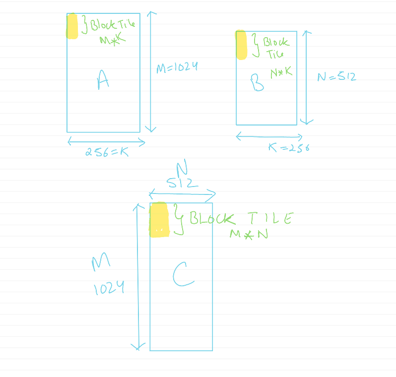
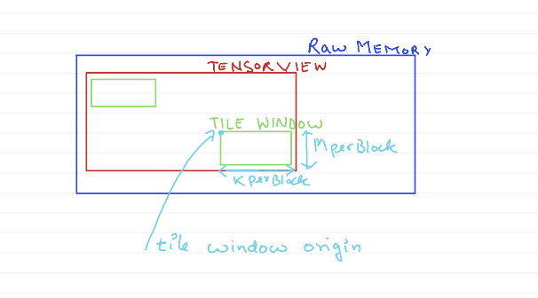

# Host-Level GEMM Coordination

At this level, we create tensor views and dispatch work to block-level GEMM.
## Key Concepts

### 1. **Problem Definition**

Problem defines the complete GEMM problem specification:

```cpp
template <typename ADataType_, typename BDataType_, typename CDataType_,
          typename AccDataType_, typename Shape_>
struct PracticeGemmHostProblem
{
    using ADataType   = ADataType_;    // Input matrix A type (half_t)
    using BDataType   = BDataType_;    // Input matrix B type (half_t)
    using CDataType   = CDataType_;    // Output matrix C type (float)
    using AccDataType = AccDataType_;  // Accumulation type (float)
    using Shape       = Shape_;        // Block and wave tile shapes
};
```

**Key characteristics:**
- **Data types**: F16 inputs, F32 accumulation/output
- **Memory layout**: All matrices are row-major with appropriate strides
  - A (M×K): strides {K, 1} - each row has K elements, elements are contiguous
  - B (N×K): strides {K, 1} - each row has K elements, elements are contiguous
  - C (M×N): strides {N, 1} - each row has N elements, elements are contiguous
- **Problem dimensions**: M × K × N matrix multiplication

### 2. **Tensor Views**

A **tensor view** describes the problem tensor and encompasses:
- **Raw memory pointer**: The actual memory location of the tensor data
- **Logical dimensions**: The shape of the tensor (e.g., M×K for A matrix)
- **Strides**: The memory layout, specifying how many elements to skip in each dimension
- **Last guaranteed stride**: Number of elements that can be loaded by one assembly load instruction
- **Vector stride**: Stride for elements in the last guaranteed vector dimension

For example, if we have a matrix A with shape (M, K) with row-major layout and data type F16, we can create a tensor view for it as follows:
```cpp
auto a_dram = make_naive_tensor_view<address_space_enum::global>(
    p_a, make_tuple(M, K), make_tuple(stride_a, 1), number<8>{}, number<1>{});
```
Last guaranteed stride is 8 because F16 is 2 bytes and we can load 8 elements by one assembly load instruction. Vector stride is 1 because each element is next to each other in vectorized load.

Tensor views are created for our matrices in global memory:
```cpp
// Inside PracticeGemmKernel::operator()
auto a_dram = [&] {
    return make_naive_tensor_view<address_space_enum::global>(
        p_a, make_tuple(M, K), make_tuple(stride_a, 1), number<8>{}, number<1>{});
}();

auto b_dram = [&] {
    return make_naive_tensor_view<address_space_enum::global>(
        p_b, make_tuple(N, K), make_tuple(stride_b, 1), number<8>{}, number<1>{});
}();

const auto c_dram = [&] {
    return make_naive_tensor_view<address_space_enum::global>(
        p_c, make_tuple(M, N), make_tuple(stride_c, 1), number<8>{}, number<1>{});
}();
```

### 3. **Policy**

Policy manages kernel launch configuration and block-to-tile mapping.

```cpp
struct PracticeGemmHostPolicy
{
    // Block-to-tile mapping for 2D grid
    CK_TILE_HOST_DEVICE static constexpr auto MakeBlock2TileMap(index_t M0, index_t N0)

    // Returns the GEMM pipeline for block-level GEMM
    template <typename Problem>
    CK_TILE_HOST_DEVICE static constexpr auto GetPracticeGemmBlockPipeline()
};
```

**Block-to-tile mapping:** Unlike traditional grid, our grid only has blocks in X dimension. This maps 1D block IDs to 2D tile coordinates (M, N).
```cpp
const auto unmerge = make_merge_transform(make_tuple(N0, M0));

return [unmerge](index_t block_id) {
    multi_index<2> unmerged;
    unmerge.calculate_lower_index(unmerged, make_multi_index(block_id));
    return make_multi_index(unmerged.at(number<1>{}), unmerged.at(number<0>{}));
};
```

### 4. **Pipeline Execution**

The pipeline coordinates execution and manages tile coordination:

```cpp
template <typename Problem_, typename Policy_>
struct PracticeGemmHostPipeline
{
    // Main execution operator
    template <typename ADRAMTensorView, typename BDRAMTensorView, typename CDRAMTensorView>
    CK_TILE_DEVICE void operator()(const ADRAMTensorView& a_dram,
                                   const BDRAMTensorView& b_dram,
                                   CDRAMTensorView& c_dram) const;
};
```

Each thread of the kernel:
1. **Fetches problem shape**: Gets M, N, and K dimensions
2. **Calculates tile requirements**: Determines total number of C block tiles needed
3. **Maps block to tile**: Uses `Policy::MakeBlock2TileMap()` to determine which block tile each thread block works on

```cpp
// Get block id and map to tile coordinates
const auto id_block = get_block_id();
const auto block2tile = Policy::MakeBlock2TileMap(num_tile_m, num_tile_n);
const auto tile_id = block2tile(id_block);

const auto tile_id_m = tile_id.template get(number<0>{});
const auto tile_id_n = tile_id.template get(number<1>{});

// Calculate tile origin in the matrix
const auto tile_origin_m = tile_id_m * MPerBlock;
const auto tile_origin_n = tile_id_n * NPerBlock;
```



### 5. **Tile Windows**

Tile windows provide views into tensors with specific offsets:

```cpp
// Create tile windows over DRAM for A and B
const auto a_block_window = make_tile_window(
    a_dram, make_tuple(number<MPerBlock>{}, number<KPerBlock>{}), {tile_origin_m, 0});

const auto b_block_window = make_tile_window(
    b_dram, make_tuple(number<NPerBlock>{}, number<KPerBlock>{}), {tile_origin_n, 0});
```

A **tile window** is a view into a tensor that defines:
- **Bottom tensor view**: The underlying tensor being viewed
- **Window lengths**: The dimensions of the tile (e.g., MPerBlock × KPerBlock)
- **Window origin**: The starting coordinates in the tensor
- **Tile distribution**: How work is distributed among threads

when no tile distribution is provided, it will be set to a default distribution.



### 6. **Result Storage**

The block-level pipeline returns a resultant C block tile that is stored back into DRAM.
`block_gemm_pipeline` loads A and B block tiles from DRAM to LDS, performs block GEMM using smaller tiles (WarpTiles), and returns the resultant C block tile.

```cpp
// Call block-level GEMM pipeline
const auto c_block_tile = block_gemm_pipeline(a_block_window, b_block_window, num_loops_k, p_smem);

// Create output window and store result
auto c_window = make_tile_window(c_dram,
                                 make_tuple(number<MPerBlock>{}, number<NPerBlock>{}),
                                 {tile_origin_m, tile_origin_n});
store_tile(c_window, c_block_tile); // store_tile(destination window, source tile)
```


