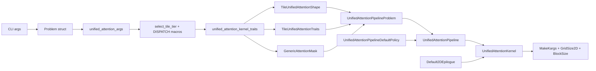

# Unified Attention — Variables, Template Parameters & Constants

A reference for every template parameter, type alias, static constant, member
variable, and kernel-launch argument that participates in the `unified_attention`
op (example 42), with a concrete sample value drawn from a single canonical run.

For per-variant resolved values (Prefill / Decode Medium / Small / Tiny / BS32),
see the companion [PARAMETERS.md](PARAMETERS.md).

---

## Canonical sample input

All "Sample value" columns below assume this command:

```bash
./example_unified_attention \
    --prec=bf16 --d=128 --nqpkv=1 --h_k=8 --b=3 \
    --s=3328 --page_blk_size=128 --causal=0 --varlen=1 \
    --scale_s=0 --seed=11939
```

Which implies:

| Knob              | Value           |
|-------------------|-----------------|
| Data type         | bf16            |
| Head dim          | 128             |
| GQA ratio (`nqpkv`) | 1 (MHA)        |
| `nhead_kv`        | 8               |
| `nhead_q`         | 8 (= 8 × 1)     |
| Batch size        | 3               |
| Max seqlen_q      | 3328            |
| Page block size   | 128             |
| Mask              | causal — see note below |
| Variable length   | yes             |

> **Mask note:** The CLI flag `--causal=0` is *not* honoured by `run_impl` —
> `example_unified_attention.cpp` line 339 hard-codes
> `args.mask_type = 2` (`MASK_FROM_BOTTOM_RIGHT`). So `is_mask = true` in the
> dispatcher, and the canonical sample actually instantiates
> `unified_attention_kernel_traits<bf16, true, 128, 256, 1>` (the **masked**
> Prefill tier).

This routes through [unified_attention.cpp](unified_attention.cpp) lines 97–108
(`hdim==128 && num_queries_per_kv==1`) and instantiates
`unified_attention_kernel_traits<bf16, true, 128, 256, 1>` — the **Prefill**
tier with masking.

### Derived runtime values

| Symbol                 | Formula                                       | Sample value                       |
|------------------------|-----------------------------------------------|------------------------------------|
| `num_tokens`           | sum(`query_lens`), random in `[1, 3328]^3`    | varies (≈3000–10000)               |
| `num_blks`             | `nb` CLI default                              | 1024                               |
| `total_num_q_blocks`   | `num_tokens / kBlockQ + num_seqs`             | `num_tokens / 256 + 3`             |
| `query_stride_0`       | `hdim * nhead_q`                              | 1024                               |
| `query_stride_1`       | `hdim`                                        | 128                                |
| `stride_k_cache_0`     | `hdim * nhead_kv * page_blk_size`             | 131072                             |
| `stride_k_cache_1`     | `hdim * nhead_kv`                             | 1024                               |
| `stride_k_cache_2`     | `hdim`                                        | 128                                |
| `stride_k_cache_3`     | 1                                             | 1                                  |
| `output_stride_0/1`    | same as `query_stride_0/1`                    | 1024, 128                          |

---

## Composition chain



---

## 1. Example main — `example_unified_attention.cpp`

File: [example_unified_attention.cpp](example_unified_attention.cpp)

### 1.1 CLI arguments (`parse_cmd_args`)

| Name              | Kind         | Defined in                    | Meaning                                                  | Sample value |
|-------------------|--------------|-------------------------------|----------------------------------------------------------|--------------|
| `prec`            | string flag  | example_unified_attention.cpp | Data type, `"fp16"` or `"bf16"`                          | `bf16`       |
| `nqpkv`           | int flag     | example_unified_attention.cpp | GQA ratio (Q heads per KV head)                          | 1            |
| `h_k`             | int flag     | example_unified_attention.cpp | Number of KV heads (Q heads = `h_k * nqpkv`)             | 8            |
| `s`               | int flag     | example_unified_attention.cpp | Max seqlen_q                                              | 3328         |
| `s_k`             | int flag     | example_unified_attention.cpp | Max seqlen_kv (-1 → equal to `s`)                         | -1 → 3328    |
| `nb`              | int flag     | example_unified_attention.cpp | `num_blks` for paged KV cache                             | 1024         |
| `b`               | int flag     | example_unified_attention.cpp | Batch size                                                | 3            |
| `d`               | int flag     | example_unified_attention.cpp | Head dim for Q & K                                        | 128          |
| `scale_s`         | float flag   | example_unified_attention.cpp | S-scale; 0 → `1/sqrt(hdim)`                               | 0 → `1/sqrt(128)` ≈ 0.0884 |
| `scale`           | float flag   | example_unified_attention.cpp | Generic scale                                             | 1            |
| `scale_k`         | float flag   | example_unified_attention.cpp | K scale                                                   | 1            |
| `scale_v`         | float flag   | example_unified_attention.cpp | V scale                                                   | 1            |
| `scale_out`       | float flag   | example_unified_attention.cpp | Output scale                                              | 1            |
| `iperm`           | bool flag    | example_unified_attention.cpp | Permute input layout (unused in current run_impl)         | 0            |
| `operm`           | bool flag    | example_unified_attention.cpp | Permute output layout                                     | 0            |
| `causal`          | int flag     | example_unified_attention.cpp | 0 = no mask, 1 = causal mask                              | 0            |
| `verify`          | bool flag    | example_unified_attention.cpp | Run host reference & compare                              | 1            |
| `varlen`          | bool flag    | example_unified_attention.cpp | 0 = fixed length, 1 = random per-batch lengths            | 1            |
| `seed`            | uint32 flag  | example_unified_attention.cpp | RNG seed (0 → non-deterministic)                          | 11939        |
| `warmup`          | int flag     | example_unified_attention.cpp | Warmup iterations before timing                           | 5            |
| `repeat`          | int flag     | example_unified_attention.cpp | Benchmark iterations                                      | 30           |
| `page_blk_size`   | int flag     | example_unified_attention.cpp | KV-cache page block size                                  | 128          |
| `query_lens`      | int vec flag | example_unified_attention.cpp | Per-batch Q seqlen override (comma-separated)             | empty        |
| `kv_lens`         | int vec flag | example_unified_attention.cpp | Per-batch KV seqlen override                              | empty        |

### 1.2 `Problem` struct

| Field                  | Type                          | Source                              | Sample value           |
|------------------------|-------------------------------|-------------------------------------|------------------------|
| `data_type`            | `unified_attention_args::data_type_enum` | from `prec`                | `bf16`                 |
| `batch`                | `index_t`                     | from `b`                            | 3                      |
| `num_blks`             | `index_t`                     | from `nb`                           | 1024                   |
| `nhead_q`              | `index_t`                     | `nhead_kv * num_queries_per_kv`     | 8                      |
| `nhead_kv`             | `index_t`                     | from `h_k`                          | 8                      |
| `num_queries_per_kv`   | `index_t`                     | from `nqpkv`                        | 1                      |
| `hdim`                 | `index_t`                     | from `d`                            | 128                    |
| `page_blk_size`        | `index_t`                     | from `page_blk_size`                | 128                    |
| `num_tokens`           | `index_t`                     | sum of `query_lens`                 | varies                 |
| `scale_s`              | `float`                       | from `scale_s` (0 → `1/sqrt(hdim)`) | ≈ 0.0884               |
| `scale`                | `float`                       | from `scale`                        | 1.0                    |
| `scale_k`              | `float`                       | from `scale_k`                      | 1.0                    |
| `scale_v`              | `float`                       | from `scale_v`                      | 1.0                    |
| `mask`                 | `mask_info`                   | (currently unused at construction)  | —                      |
| `query_lens`           | `vector<int>`                 | random in `[1, s]^b`                | e.g. `{1804, 902, 2710}` |
| `kv_lens`              | `vector<int>`                 | random in `[1, s_k]^b`              | e.g. `{2933, 1027, 3050}` |

Helper methods (return value shapes):

| Method                | Returns                                          |
|-----------------------|--------------------------------------------------|
| `get_query_shape()`   | `{num_tokens, nhead_q, hdim}`                    |
| `get_key_shape()`     | `{num_blks, page_blk_size, nhead_kv, hdim}`      |
| `get_value_shape()`   | `{num_blks, page_blk_size, nhead_kv, hdim}`      |
| `get_output_shape()`  | `{num_tokens, nhead_q, hdim}`                    |

### 1.3 `RunConfig` struct

| Field             | Type                       | Source       | Sample value |
|-------------------|----------------------------|--------------|--------------|
| `seed`            | `optional<uint32_t>`       | from `seed`  | 11939        |
| `kernel_warmup`   | `int`                      | from `warmup`| 5            |
| `kernel_repeat`   | `int`                      | from `repeat`| 30           |
| `verify`          | `bool`                     | from `verify`| true         |

### 1.4 Stride wiring inside `run_impl`

```cpp
args.query_stride_0 = problem.hdim * problem.nhead_q;   // 128 * 8   = 1024
args.query_stride_1 = problem.hdim;                     // 128
args.stride_k_cache_0 = problem.hdim * problem.nhead_kv * problem.page_blk_size; // 131072
args.stride_k_cache_1 = problem.hdim * problem.nhead_kv;                          // 1024
args.stride_k_cache_2 = problem.hdim;                                              // 128
args.stride_k_cache_3 = 1;
// V cache strides mirror K cache strides.
args.output_stride_0 = args.query_stride_0;
args.output_stride_1 = args.query_stride_1;
```

Cumulative query lengths (`cu_query_lens`) and `seq_lens` device buffers are
built from `eff_query_lens` / `eff_kv_lens`, then assigned to
`args.query_start_len_ptr` and `args.seq_lens_ptr`. `block_tables_host` is
filled with random ints in `[0, num_blks)` and shape
`[batch, max_num_blocks_per_seq]`.

---

## 2. Host-side args — `unified_attention_args`

File: [unified_attention.hpp](unified_attention.hpp)

| Field                  | Type                       | Meaning                                                                 | Sample value |
|------------------------|----------------------------|-------------------------------------------------------------------------|--------------|
| `data_type`            | `data_type_enum`           | `fp16` or `bf16`                                                        | `bf16`       |
| `mask_type`            | `index_t`                  | 0 = no mask, 2 = causal mask (`run_impl` hard-codes 2)                  | 2            |
| `num_tokens`           | `index_t`                  | Total Q tokens across batch                                             | sum(query_lens) |
| `num_blks`             | `index_t`                  | Total physical pages in KV cache                                        | 1024         |
| `num_head_q`           | `index_t`                  | Q heads                                                                 | 8            |
| `num_queries_per_kv`   | `index_t`                  | GQA ratio                                                               | 1            |
| `page_blk_size`        | `index_t`                  | KV-cache page block size                                                | 128          |
| `hdim`                 | `index_t`                  | Head dim                                                                | 128          |
| `scale_s`              | `float`                    | Pre-softmax scale (host); kernel multiplies by `log2e_v`                | `1/sqrt(128)` |
| `scale`                | `float`                    | Reserved generic scale                                                  | 1.0          |
| `scale_k`              | `float`                    | K scale (FP8 quant)                                                     | 1.0          |
| `scale_v`              | `float`                    | V scale (FP8 quant)                                                     | 1.0          |
| `scale_out`            | `float`                    | Output rescale                                                          | 1.0          |
| `q_ptr`                | `const void*`              | Q tensor device ptr, shape `[num_tokens, nhead_q, hdim]`                | device       |
| `query_stride_0`       | `index_t`                  | Q stride along tokens                                                   | 1024         |
| `query_stride_1`       | `index_t`                  | Q stride along heads                                                    | 128          |
| `k_ptr`                | `const void*`              | Paged K cache, shape `[num_blks, page_blk_size, nhead_kv, hdim]`        | device       |
| `stride_k_cache_0..3`  | `index_t` × 4              | K-cache strides (block, page-row, head, dim)                            | 131072, 1024, 128, 1 |
| `v_ptr`                | `const void*`              | Paged V cache (same layout as K)                                        | device       |
| `stride_v_cache_0..3`  | `index_t` × 4              | V-cache strides                                                         | 131072, 1024, 128, 1 |
| `o_ptr`                | `void*`                    | Output, shape `[num_tokens, nhead_q, hdim]`                             | device       |
| `output_stride_0/1`    | `index_t` × 2              | Output strides (tokens, heads)                                          | 1024, 128    |
| `block_tables_ptr`     | `const int32_t*`           | `[num_seqs, max_blocks_per_seq]` int32, indexes into K/V pages          | device       |
| `block_table_stride`   | `index_t`                  | Row stride for `block_tables_ptr` (= max_blocks_per_seq)                | `ceil(max_kv/128)` |
| `seq_lens_ptr`         | `const int32_t*`           | Per-batch KV seqlen                                                     | device       |
| `query_start_len_ptr`  | `const int32_t*`           | Cumulative Q start offsets, length `num_seqs + 1`                       | device       |
| `num_seqs`             | `index_t`                  | Batch size                                                              | 3            |
| `max_seqlen_q`         | `index_t`                  | Max Q seqlen across batch (0 = unknown)                                 | 0 (default)  |

Also defined in the same header:

```cpp
struct UnifiedAttentionMasks {
    using NoMask      = ck_tile::GenericAttentionMask<false>;
    using GenericMask = ck_tile::GenericAttentionMask<true, true>;
    using CausalMask  = ck_tile::GenericAttentionMask<true, false>;
};
```

For the sample (`causal=0`), `FmhaMask = GenericAttentionMask<false>` (NoMask).

---

## 3. Dispatch — `unified_attention.cpp`

File: [unified_attention.cpp](unified_attention.cpp)

### 3.1 Tile-tier selection

```cpp
enum class tile_tier { large, medium, small, tiny };

static tile_tier select_tile_tier(const unified_attention_args& args) {
    const index_t avg_q          = args.num_seqs > 0
                                       ? args.num_tokens / args.num_seqs
                                       : args.num_tokens;
    const index_t kBlockQ_tiny   = 16  / args.num_queries_per_kv;
    const index_t kBlockQ_small  = 64  / args.num_queries_per_kv;
    const index_t kBlockQ_medium = 128 / args.num_queries_per_kv;
    const index_t max_q          = args.max_seqlen_q > 0
                                       ? args.max_seqlen_q : avg_q;
    if (avg_q <= kBlockQ_tiny  && max_q <= kBlockQ_tiny ) return tile_tier::tiny;
    if (avg_q <= kBlockQ_small && max_q <= kBlockQ_small) return tile_tier::small;
    return tile_tier::medium;
}
```

| Symbol             | Sample value (`nqpkv=1`) |
|--------------------|--------------------------|
| `kBlockQ_tiny`     | 16                       |
| `kBlockQ_small`    | 64                       |
| `kBlockQ_medium`   | 128                      |

### 3.2 Dispatch macros

| Macro                                             | Traits used                                | Grid mode |
|---------------------------------------------------|--------------------------------------------|-----------|
| `DISPATCH_UNIFIED_ATTENTION`                      | `unified_attention_kernel_traits`          | standard 1D |
| `DISPATCH_UNIFIED_ATTENTION_DECODE_MEDIUM`        | `unified_attention_decode_kernel_traits`   | standard 1D |
| `DISPATCH_UNIFIED_ATTENTION_DECODE_SMALL`         | `unified_attention_decode_small_kernel_traits` | decode 2D |
| `DISPATCH_UNIFIED_ATTENTION_DECODE_TINY`          | `unified_attention_decode_tiny_kernel_traits` | decode 2D |
| `DISPATCH_UNIFIED_ATTENTION_DECODE_MEDIUM_BS32`   | `unified_attention_decode_kernel_traits<..., 32>` | standard 1D |
| `DISPATCH_UNIFIED_ATTENTION_DECODE_SMALL_BS32`    | `unified_attention_decode_small_kernel_traits<..., 32>` | decode 2D |
| `DISPATCH_UNIFIED_ATTENTION_DECODE_BS32_NARROW`   | `unified_attention_decode_bs32_kernel_traits` | decode 2D |

### 3.3 Path chosen by sample

`hdim==128 && num_queries_per_kv==1`, and `is_mask = (mask_type != 0) = true`
because `run_impl` sets `args.mask_type = 2`, so the dispatcher selects
`unified_attention_kernel_traits<bf16, true, 128, 256, 1>` (Prefill, masked).

---

## 4. Kernel traits — `unified_attention_kernel_traits`

File: [unified_attention_impl.hpp](unified_attention_impl.hpp)

### 4.1 `unified_attention_problem_traits<DataType>`

| Member       | Type for `bf16` | Type for `fp16` |
|--------------|-----------------|-----------------|
| `qkvp_dtype` | `bf16_t`        | `half_t`        |
| `acc_dtype`  | `float`         | `float`         |
| `o_dtype`    | `bf16_t`        | `half_t`        |
| `lse_dtype`  | `float`         | `float`         |

### 4.2 Template parameters

| Param          | Default                       | Sample value |
|----------------|-------------------------------|--------------|
| `DataType`     | —                             | `bf16`       |
| `IsMasking`    | —                             | `true`       |
| `HeadSize_`    | 128                           | 128          |
| `BlockM_`      | 256                           | 256          |
| `NumQPerKV_`   | 1                             | 1            |
| `BlockSize_`   | `(HeadSize_ <= 64) ? 64 : 32` | 32           |

### 4.3 Static constants

| Name                  | Value (sample) |
|-----------------------|----------------|
| `date_type`           | `bf16`         |
| `is_masking`          | `true`         |
| `kBlockM`             | 256            |
| `HEAD_SIZE`           | 128            |
| `BLOCK_SIZE`          | 32             |
| `num_queries_per_kv`  | 1              |
| `kBlockQ`             | `kBlockM / num_queries_per_kv` = 256 |

### 4.4 Type aliases

| Alias                                | Resolved type (sample)                                                |
|--------------------------------------|-----------------------------------------------------------------------|
| `unified_attention_block_tile`       | `sequence<256, 256, 32, 128>` (= `<kBlockM, kBlockQ, BLOCK_SIZE, HEAD_SIZE>`) |
| `unified_attention_warp_gemm_shape`  | `sequence<32, 32, 16>`                                                |
| `unified_attention_block_warps`      | `sequence<8, 1, 1>`                                                   |
| `unified_attention_shape`            | `TileUnifiedAttentionShape<block_tile, block_warps, warp_gemm_shape, block_warps, warp_gemm_shape, true>` |
| `unified_attention_traits`           | `TileUnifiedAttentionTraits<true, false, -1>`                         |
| `unified_attention_mask`             | `GenericAttentionMask<true, false>` (causal, top-left anchoring)      |
| `unified_attention_pipeline_problem` | `UnifiedAttentionPipelineProblem<bf16_t × 4, float × 3, bf16_t, float, bf16_t, shape, mask, traits>` |
| `unified_attention_pipeline`         | `UnifiedAttentionPipeline<pipeline_problem>` (uses default policy)    |
| `epilogue`                           | `Default2DEpilogue<Default2DEpilogueProblem<float, bf16_t, true, true, true>>` |
| `kernel`                             | `UnifiedAttentionKernel<pipeline, epilogue>`                          |

### 4.5 Other trait variants (not used by sample)

| Variant struct                              | Default HeadSize / BlockM / NQPKV / BlockSize | Policy used                              |
|---------------------------------------------|-----------------------------------------------|------------------------------------------|
| `unified_attention_kernel_traits`           | 128 / 256 / 1 / 32                            | `DefaultPolicy` (8 warps)                |
| `unified_attention_decode_kernel_traits`    | 128 / 128 / 1 / 32                            | `DefaultPolicy` (4 warps)                |
| `unified_attention_decode_small_kernel_traits` | 64 / 64 / 8 / 64                           | `DecodePolicy` (2 warps)                 |
| `unified_attention_decode_tiny_kernel_traits`  | 64 / 16 / 8 / 64                           | `TinyDecodePolicy` (1 warp, 16×16 MFMA)  |
| `unified_attention_decode_bs32_kernel_traits`  | 64 / 32 / 8 / 32                           | `DecodePolicy` (2 warps, 16×16 MFMA)     |

---

## 5. Shape — `TileUnifiedAttentionShape`

File: [tile_unified_attention_shape.hpp](../../../include/ck_tile/ops/unified_attention/pipeline/tile_unified_attention_shape.hpp)

### 5.1 Template parameters

| Param                 | Sample value                  |
|-----------------------|-------------------------------|
| `BlockTile_`          | `sequence<256, 256, 32, 128>` |
| `Gemm0BlockWarps_`    | `sequence<8, 1, 1>`           |
| `Gemm0WarpTile_`      | `sequence<32, 32, 16>`        |
| `Gemm1BlockWarps_`    | `sequence<8, 1, 1>`           |
| `Gemm1WarpTile_`      | `sequence<32, 32, 16>`        |
| `IsVLayoutRowMajor_`  | `true`                        |

### 5.2 Static constants

| Name              | Formula                                                | Sample value |
|-------------------|--------------------------------------------------------|--------------|
| `NumGemm0Warps`   | `reduce_on_sequence(Gemm0BlockWarps, multiplies)`      | 8            |
| `NumGemm1Warps`   | `reduce_on_sequence(Gemm1BlockWarps, multiplies)`      | 8            |
| `NumWarps`        | `max(NumGemm0Warps, NumGemm1Warps)`                    | 8            |
| `kBlockM`         | `BlockTile::at<0>`                                     | 256          |
| `kBlockQ`         | `BlockTile::at<1>`                                     | 256          |
| `kPageBlockSize`  | `BlockTile::at<2>`                                     | 32           |
| `kHeadDim`        | `BlockTile::at<3>`                                     | 128          |
| `kHeadDimPadded`  | `ceil_to_qualified_tile_length<kHeadDim>()`            | 128          |
| `IsVLayoutRowMajor` | from template arg                                    | true         |
| `VLayout`         | `RowMajor` if `IsVLayoutRowMajor`, else `ColumnMajor`  | `RowMajor`   |

### 5.3 `ceil_to_qualified_tile_length<Headdim>` mapping

| Input | Output |
|-------|--------|
| 48    | 48     |
| 64    | 64     |
| 96    | 128    |
| 128   | 128    |
| 160   | 256    |
| 192   | 192    |
| 256   | 256    |
| other power-of-two | same |

---

## 6. Traits — `TileUnifiedAttentionTraits`

File: [tile_unified_attention_traits.hpp](../../../include/ck_tile/ops/unified_attention/pipeline/tile_unified_attention_traits.hpp)

| Name           | Kind                  | Meaning                                       | Sample value |
|----------------|-----------------------|-----------------------------------------------|--------------|
| `kPadSeqLenQ_` | template `bool`       | Pad along seqlen_q dimension                  | `true`       |
| `kPadHeadDim_` | template `bool`       | Pad along head dim (Q/K/V/O)                  | `false`      |
| `kBlockPerCu_` | template `index_t`    | Occupancy override; `-1` keeps default        | `-1`         |
| `kPadSeqLenQ`  | static constant       | exposed `kPadSeqLenQ_`                        | `true`       |
| `kPadHeadDim`  | static constant       | exposed `kPadHeadDim_`                        | `false`      |
| `kBlockPerCu`  | static constant       | exposed `kBlockPerCu_`                        | `-1`         |

---

## 7. Pipeline problem — `UnifiedAttentionPipelineProblem`

File: [unified_attention_pipeline_problem.hpp](../../../include/ck_tile/ops/unified_attention/pipeline/unified_attention_pipeline_problem.hpp)

### 7.1 Template parameters (in order)

| Param                      | Sample value (bf16 prefill) |
|----------------------------|------------------------------|
| `QDataType_`               | `bf16_t`                     |
| `KDataType_`               | `bf16_t`                     |
| `VDataType_`               | `bf16_t`                     |
| `SaccDataType_`            | `float`                      |
| `SMPLComputeDataType_`     | `float`                      |
| `BiasDataType_`            | `float`                      |
| `RandValOutputDataType_`   | `float` (also LSE)           |
| `PDataType_`               | `bf16_t`                     |
| `OaccDataType_`            | `float`                      |
| `ODataType_`               | `bf16_t`                     |
| `UnifiedAttentionShape_`   | shape from §5                |
| `FmhaMask_`                | `GenericAttentionMask<true, false>`  |
| `Traits_`                  | `TileUnifiedAttentionTraits<true, false, -1>` |

### 7.2 Type aliases (after `remove_cvref_t`)

`QDataType`, `KDataType`, `VDataType`, `SaccDataType`, `SMPLComputeDataType`,
`BiasDataType`, `RandValOutputDataType`, `PDataType`, `OaccDataType`,
`ODataType`, `UnifiedAttentionShape`, `Traits`, `FmhaMask` — all map directly
to the template parameters above.

### 7.3 Static constants

| Name                  | Formula                                                    | Sample value |
|-----------------------|------------------------------------------------------------|--------------|
| `kNumGemm0Warps`      | `UnifiedAttentionShape::NumGemm0Warps`                     | 8            |
| `kNumGemm1Warps`      | `UnifiedAttentionShape::NumGemm1Warps`                     | 8            |
| `kBlockSize`          | `NumWarps * get_warp_size()` (= 8 × 64)                    | 512          |
| `kPadSeqLenQ`         | `Traits::kPadSeqLenQ`                                      | `true`       |
| `kPadHeadDim`         | `Traits::kPadHeadDim`                                      | `false`      |
| `kHasLogitsSoftCap`   | `Traits::kHasLogitsSoftCap` (default false)                | `false`      |
| `kSkipMinSeqlenQ`     | `Traits::kSkipMinSeqlenQ`                                  | `false`      |
| `kHasDropout`         | `Traits::kHasDropout`                                      | `false`      |
| `kDoFp8StaticQuant`   | `Traits::kDoFp8StaticQuant`                                | `false`      |
| `kBlockPerCu`         | `Traits::kBlockPerCu`                                      | `-1`         |

---

## 8. Pipeline — `UnifiedAttentionPipeline`

File: [unified_attention_pipeline.hpp](../../../include/ck_tile/ops/unified_attention/pipeline/unified_attention_pipeline.hpp)

### 8.1 Template parameters

| Param      | Default                                | Sample value                            |
|------------|----------------------------------------|-----------------------------------------|
| `Problem_` | —                                      | `UnifiedAttentionPipelineProblem<...>`  |
| `Policy_`  | `UnifiedAttentionPipelineDefaultPolicy`| `UnifiedAttentionPipelineDefaultPolicy` |

### 8.2 Type aliases

`Problem`, `Policy`, `QDataType`, `KDataType`, `VDataType`, `SaccDataType`,
`SMPLComputeDataType`, `PDataType`, `OaccDataType`, `ODataType`, `FmhaMask`,
`UnifiedAttentionShape` — all forwarded from `Problem`.

### 8.3 Static constants

| Name              | Formula                                              | Sample value |
|-------------------|------------------------------------------------------|--------------|
| `kBlockSize`      | `Problem::kBlockSize`                                | 512          |
| `kBlockM`         | `UnifiedAttentionShape::kBlockM`                     | 256          |
| `kBlockQ`         | `UnifiedAttentionShape::kBlockQ`                     | 256          |
| `kWarpGemmM`      | `Gemm0WarpTile::at<0>`                               | 32           |
| `kPageBlockSize`  | `UnifiedAttentionShape::kPageBlockSize`              | 32           |
| `kHeadDim`        | `UnifiedAttentionShape::kHeadDim`                    | 128          |
| `kHeadDimPadded`  | `UnifiedAttentionShape::kHeadDimPadded`              | 128          |
| `kPadHeadDimQ`    | `Problem::kPadHeadDim`                               | `false`      |
| `kPadHeadDimV`    | `Problem::kPadHeadDim`                               | `false`      |
| `kAlignmentQ`     | `kPadHeadDimQ ? 1 : Policy::GetAlignmentQ<Problem>()`| 4 (see §9)   |
| `kAlignmentK`     | `kPadHeadDimQ ? 1 : Policy::GetAlignmentK<Problem>()`| 2 (gfx9) / 8 (gfx950) |
| `kAlignmentV`     | `kPadHeadDimV ? 1 : Policy::GetAlignmentV<Problem>()`| 2 (gfx9) / 8 (gfx950) |
| `kAlignmentO`     | `kPadHeadDimV ? 1 : Policy::GetAlignmentO<Problem>()`| 4 (= `kCM1PerLane` for 32×32×16) |
| `kBlockPerCu`     | `Problem::kBlockPerCu != -1 ? Problem::kBlockPerCu : 2` | 2         |

### 8.4 `GetSmemSize()`

```cpp
static constexpr index_t GetSmemSize() {
    return max(kBlockM * kHeadDimPadded * sizeof(PDataType),                       // scenario A
               Policy::GetSmemSize<Problem>() + kBlockM * kPageBlockSize * sizeof(PDataType)); // scenario B
}
```

Sample (bf16, `sizeof(PDataType) = 2`):
- Scenario A: `256 × 128 × 2` = **65 536 B (64 KiB)**
- Scenario B: `Policy::GetSmemSize` (4 × `GetSmemSizeKV`, ~64 KiB) + `256 × 32 × 2` (16 KiB) ≈ **~80 KiB**
- `max(...) ≈ 80 KiB`

See [PARAMETERS.md §LDS](PARAMETERS.md) for the full per-variant breakdown.

---

## 9. Policy — `UnifiedAttentionPipelineDefaultPolicy`

File: [unified_attention_pipeline_default_policy.hpp](../../../include/ck_tile/ops/unified_attention/pipeline/unified_attention_pipeline_default_policy.hpp)

### 9.1 Static constants

| Name                      | Formula                                  | Sample value |
|---------------------------|------------------------------------------|--------------|
| `NumWarpPerGroup`         | constant                                 | 4            |
| `NumThreadPerWarpGroup`   | `NumWarpPerGroup * get_warp_size()`      | 256          |
| `kKLdsPadInBytes`         | `4 * 4` dwords                           | 16           |
| `kVLdsPadInBytes`         | `4 * 16` dwords                          | 64           |

### 9.2 Per-`Problem` getters

| Function                          | Returns (sample, bf16)                                              |
|-----------------------------------|---------------------------------------------------------------------|
| `GetAlignmentQ<Problem>()`        | `min(16 / sizeof(QDataType), WG::kK / WG::WarpGemmAttribute::Impl::kABKLane)` = `min(8, 16/4)` = **4** |
| `GetAlignmentK<Problem>()`        | gfx950: `16 / sizeof(KDataType)` = **8**; else: `4 / sizeof(KDataType)` = **2** |
| `GetAlignmentV<Problem>()`        | gfx950: **8**; else: **2**                                          |
| `GetAlignmentO<Problem>()`        | `WG::WarpGemmAttribute::Impl::kCM1PerLane` (= **4** for 32×32×16)   |
| `GetSmemKPackK<Problem>()`        | `16 / sizeof(KDataType)`                                     = **8** |
| `GetSmemVPackK<Problem>()`        | `16 / sizeof(VDataType)`                                     = **8** |
| `GetQKBlockGemm<Problem>()`       | `BlockGemmARegBRegCRegV2` with `TileGemmShape<<256,32,128>, <8,1,1>, <32,32,16>>` |
| `GetPVBlockGemm<Problem>()`       | `BlockGemmARegBRegCRegV2` with `TileGemmShape<<256,128,32>, <8,1,1>, <32,32,16>>` |
| `GetSingleSmemElementSpaceSize<Problem>()` | elements per K/V buffer (max of K/V sizes)                 | derived |
| `GetSmemSizeKV<Problem>()`        | element-space-size × `sizeof(KDataType)`                            | derived |
| `GetSmemSize<Problem>()`          | `4 * GetSmemSizeKV<Problem>()` (quad-buffered K and V)              | derived |

### 9.3 Tile-distribution local constants

Computed inside `MakeKDramTileDistribution<Problem>()` /
`MakeVDramTileDistribution<Problem>()` / `MakeKLdsStoreBlockDescriptor<Problem>()`
/ etc.:

| Name           | Formula                                  | Sample (gfx950, K dram)  |
|----------------|------------------------------------------|--------------------------|
| `kNPerBlock`   | `kPageBlockSize` (K/V dram) or `kHeadDim` (V reg, Gemm1) | 32         |
| `kKPerBlock`   | `kHeadDim` (K/V dram) or `kPageBlockSize` (V reg, Gemm1) | 128        |
| `kBlockSize`   | `Problem::kBlockSize`                    | 512                      |
| `NumWarps`     | `UnifiedAttentionShape::NumWarps`        | 8                        |
| `WarpSize`     | `get_warp_size()`                        | 64                       |
| `KVector`      | `GetAlignmentK<Problem>()`               | 8 (gfx950) / 2 (gfx9)    |
| `LanesPerK`    | `kKPerBlock / KVector`                   | 16 (gfx950) / 64 (gfx9)  |
| `LaneGroups`   | `WarpSize / LanesPerK`                   | 4 (gfx950) / 1 (gfx9)    |
| `NumIssues`    | `kNPerBlock / (LaneGroups * NumWarps)`   | 1 (gfx950) / 4 (gfx9)    |

### 9.4 Policy variants

| Policy                                | `NumWarpPerGroup` | `NumThreadPerWarpGroup` | Used by sample? |
|---------------------------------------|-------------------|--------------------------|------------------|
| `UnifiedAttentionPipelineDefaultPolicy`  | 4               | 256                      | **yes**          |
| `UnifiedAttentionPipelineDecodePolicy`   | 2               | 128                      | no               |
| `UnifiedAttentionPipelineTinyDecodePolicy` | 1             | 64                       | no               |

The two decode variants inherit from `DefaultPolicy` and only override
`NumWarpPerGroup` / `NumThreadPerWarpGroup`.

---

## 10. Kernel — `UnifiedAttentionKernel`

File: [unified_attention_kernel.hpp](../../../include/ck_tile/ops/unified_attention/kernel/unified_attention_kernel.hpp)

### 10.1 Template parameters

| Param                       | Sample value                                  |
|-----------------------------|-----------------------------------------------|
| `UnifiedAttentionPipeline_` | `UnifiedAttentionPipeline<problem, DefaultPolicy>` |
| `EpiloguePipeline_`         | `Default2DEpilogue<...>`                      |

### 10.2 Type aliases & static constants

| Name              | Source                                          | Sample value     |
|-------------------|-------------------------------------------------|------------------|
| `UnifiedAttentionPipeline` | `remove_cvref_t<UnifiedAttentionPipeline_>` | pipeline    |
| `EpiloguePipeline`         | `remove_cvref_t<EpiloguePipeline_>`        | epilogue    |
| `QDataType` … `ODataType`  | forwarded from pipeline                    | bf16_t / float |
| `SaccDataType`             | from pipeline                              | float           |
| `FmhaMask`                 | from pipeline                              | `GenericAttentionMask<true, false>` |
| `kBlockSize`     | `Pipeline::kBlockSize`                          | 512              |
| `kBlockPerCu`    | `Pipeline::kBlockPerCu`                         | 2                |
| `kHasMask`       | `FmhaMask::IsMasking`                           | `true`           |
| `kPadSeqLenK`    | `Pipeline::kPadSeqLenK`                         | (pipeline default) |
| `kPadSeqLenQ`    | `Pipeline::kPadSeqLenQ`                         | `true`           |
| `kPadHeadDimQ`   | `Pipeline::kPadHeadDimQ`                        | `false`          |
| `kPadHeadDimV`   | `Pipeline::kPadHeadDimV`                        | `false`          |
| `kHeadDim`       | `Pipeline::kHeadDim`                            | 128              |
| `kHeadDimPadded` | `Pipeline::kHeadDimPadded`                      | 128              |
| `kBlockM`        | `Pipeline::kBlockM`                             | 256              |
| `kBlockQ`        | `Pipeline::kBlockQ`                             | 256              |
| `kPageBlockSize` | `Pipeline::kPageBlockSize`                      | 32               |

### 10.3 `UnifiedAttentionCommonKargs`

Aggregate struct holding the kernel-launch arguments. Every field has a 1:1
mapping from `unified_attention_args`, except `scale_s` which is transformed:

> `kargs.scale_s = input_scale_s * ck_tile::log2e_v<>` (≈ `(1/√128) × 1.4427` ≈ 0.1275)
> so the kernel can use `exp2` instead of `exp` after the softmax-pre-scale.

| Field                    | Type             | Source                                 | Sample value |
|--------------------------|------------------|----------------------------------------|--------------|
| `q_ptr`                  | `const void*`    | args                                   | device       |
| `k_ptr`                  | `const void*`    | args, paged `[num_blks, page, h_kv, d]`| device       |
| `v_ptr`                  | `const void*`    | args                                   | device       |
| `o_ptr`                  | `void*`          | args                                   | device       |
| `num_blks`               | `index_t`        | args                                   | 1024         |
| `num_head_q`             | `index_t`        | args                                   | 8            |
| `num_queries_per_kv`     | `const index_t`  | args                                   | 1            |
| `scale_s`                | `float`          | `args.scale_s * log2e_v`               | ≈ 0.1275     |
| `scale`                  | `float`          | args                                   | 1.0          |
| `scale_k`                | `float`          | args                                   | 1.0          |
| `scale_v`                | `float`          | args                                   | 1.0          |
| `scale_out`              | `float`          | args                                   | 1.0          |
| `page_size`              | `index_t`        | `args.page_blk_size`                   | 128          |
| `total_num_q_blocks`     | `index_t`        | `num_tokens / kBlockQ + num_seqs`      | `num_tokens/256 + 3` |
| `query_stride_0/1`       | `index_t`        | args                                   | 1024, 128    |
| `stride_k_cache_0..3`    | `index_t` × 4    | args                                   | 131072, 1024, 128, 1 |
| `stride_v_cache_0..3`    | `index_t` × 4    | args                                   | 131072, 1024, 128, 1 |
| `output_stride_0/1`      | `index_t`        | args                                   | 1024, 128    |

### 10.4 `UnifiedAttentionVarlenKargs` (additional fields)

`using Kargs = UnifiedAttentionVarlenKargs;`

| Field                     | Type               | Meaning                                                                  | Sample value |
|---------------------------|--------------------|--------------------------------------------------------------------------|--------------|
| `block_tables_ptr`        | `const int32_t*`   | Page-table device pointer                                                | device       |
| `block_table_stride`      | `index_t`          | Row stride (`max_blocks_per_seq`)                                        | `ceil(max_kv/128)` |
| `seq_lens_ptr`            | `const int32_t*`   | Per-batch KV seqlen                                                      | device       |
| `query_start_len_ptr`     | `const int32_t*`   | Cumulative Q offsets, length `num_seqs + 1`                              | device       |
| `num_seqs`                | `index_t`          | Batch size                                                               | 3            |
| `num_splits`              | `index_t`          | KV-segment parallelism splits                                            | 1 (default)  |
| `i_split`                 | `index_t`          | Current split index                                                      | 0            |
| `lse_acc_ptr`             | `void*`            | `[nhead, num_splits, total_q]` float (split-KV)                          | `nullptr`    |
| `o_acc_ptr`               | `void*`            | `[nhead, num_splits, total_q, hdim_v]` float                             | `nullptr`    |
| `split_stride_lse_acc`    | `index_t`          | Stride along split for LSE acc                                           | 0            |
| `split_stride_o_acc`      | `index_t`          | Stride along split for O acc                                             | 0            |
| `nhead_stride_lse_acc`    | `index_t`          | Stride along head for LSE acc                                            | 0            |
| `nhead_stride_o_acc`      | `index_t`          | Stride along head for O acc                                              | 0            |

### 10.5 Host helpers

| Function                                            | Meaning                                                                  | Sample value |
|-----------------------------------------------------|--------------------------------------------------------------------------|--------------|
| `MakeKargs(...)`                                    | Aggregate-initialize `Kargs` and apply the `scale_s * log2e_v` transform | —            |
| `GridSize2D(num_kv_heads, total_num_q_blocks)`      | `dim3(num_kv_heads * total_num_q_blocks)` — standard 1D grid             | `8 * total_num_q_blocks` |
| `GridSizeDecode(num_kv_heads, num_seqs)`            | `dim3(num_kv_heads, num_seqs)` — 2D grid for small/tiny decode tiers     | not used (prefill) |
| `BlockSize()`                                       | `dim3(kBlockSize)`                                                        | `dim3(512)`  |
| `GetSmemSize()`                                     | `max(Pipeline::GetSmemSize(), Epilogue::GetSmemSize())`                  | ≈ 80 KiB     |

### 10.6 Device helpers

| Function                                              | Meaning                                                              |
|-------------------------------------------------------|----------------------------------------------------------------------|
| `find_seq_idx(qsl_ptr, target_idx, num_seqs, block_q, use_q_block_mode)` | Binary search to map a Q-block global idx to a batch idx |
| `GetTileIndex(pid, kargs)`                            | Returns `(pid % num_head_kv, pid / num_head_kv)`                     |

### 10.7 `operator()` local variables

Runtime state inside the kernel body. For the sample run, with concrete
choices `pid = blockIdx.x = 0`, batch 0 (so `seq_idx = 0`,
`q_block_local_idx = 0`):

| Name                              | Meaning                                                                              | Sample formula / value |
|-----------------------------------|--------------------------------------------------------------------------------------|------------------------|
| `num_queries_per_kv`              | Local copy of `kargs.num_queries_per_kv`                                             | 1                      |
| `kv_head_idx`                     | `pid % (num_head_q / num_queries_per_kv)`                                            | 0                      |
| `seq_idx`                         | Batch index resolved via `find_seq_idx` (1D grid) or `blockIdx.y` (decode grid)      | 0                      |
| `q_block_local_idx`               | Q-block index within batch                                                           | 0                      |
| `cur_batch_in_all_start_index`    | `query_start_len_ptr[seq_idx]` — start offset of this batch in flat Q                | 0                      |
| `cur_batch_query_len`             | `query_start_len_ptr[seq_idx+1] - cur_batch_in_all_start_index`                       | e.g. 1804              |
| `query_pos`                       | `q_block_local_idx * kBlockQ`                                                         | 0                      |
| `seq_len`                         | `seq_lens_ptr[seq_idx]`                                                               | e.g. 2933              |
| `context_len`                     | `seq_len - cur_batch_query_len`                                                       | e.g. 1129              |
| `max_seq_prefix_len`              | `min(seq_len, context_len + q_block_local_idx*kBlockQ + kBlockQ)`                     | e.g. 1129 + 256 = 1385 |
| `total_num_kv_blocks`             | `ceil(max_seq_prefix_len / kPageBlockSize)`                                           | e.g. `ceil(1385/32)` = 44 |
| `num_blocks_start`                | KV-segment start (split-KV); 0 when `num_splits == 1`                                 | 0                      |
| `num_blocks`                      | KV-segment end (or `total_num_kv_blocks`)                                             | 44                     |
| `kv_head_offset`                  | `kv_head_idx * stride_k_cache_2`                                                      | 0                      |
| `q_ptr_offset_0`                  | `cur_batch_in_all_start_index * query_stride_0`                                       | 0                      |
| `q_ptr_offset_1`                  | `kv_head_idx * num_queries_per_kv * query_stride_1`                                   | 0                      |
| `q_ptr_offset`                    | `q_ptr_offset_0 + q_ptr_offset_1`                                                     | 0                      |
| `o_ptr_offset_0/1/_total`         | mirror of Q offsets, using `output_stride_*`                                          | 0                      |
| `block_table_offset`              | `seq_idx * block_table_stride`                                                        | 0                      |
| `query_len_padded`                | `ceil(cur_batch_query_len / kBlockQ) * kBlockQ`                                       | e.g. 1792 → 1792 (256-aligned: 2048) |
| `kv_page_size_in_blocks`          | `page_size / kPageBlockSize` (≥ 1 by assertion)                                        | 128 / 32 = 4           |

The kernel then constructs `q_dram`, `k_dram`, `v_dram` tile windows, builds the
mask, invokes `UnifiedAttentionPipeline{}(...)` to get `o_acc_tile`, and finally
calls `EpiloguePipeline{}(o_dram_window, o_acc_tile, nullptr)`.

---

## 11. Mask — `GenericAttentionMaskEnum`

File: [block_masking.hpp](../../../include/ck_tile/ops/unified_attention/block/block_masking.hpp)

| Name                                  | Value | Used for                                                       |
|---------------------------------------|-------|----------------------------------------------------------------|
| `NO_MASK`                             | 0     | No mask                                                        |
| `MASK_FROM_TOP_LEFT`                  | 1     | Causal / sliding-window anchored at top-left                   |
| `MASK_FROM_BOTTOM_RIGHT`              | 2     | Causal / sliding-window anchored at bottom-right                |
| `MASK_GENERIC`                        | 3     | Generic mask (debug; left/right window per row)                |

Plus `UnifiedAttentionMasks::{NoMask, GenericMask, CausalMask}` aliases in
[unified_attention.hpp](unified_attention.hpp).

For the sample run, `args.mask_type = 2` (hard-coded by `run_impl` regardless
of the `--causal` CLI flag), so `is_mask = true` in the dispatcher and the
chosen kernel uses `IsMasking = true`. `FmhaMask` resolves to
`GenericAttentionMask<true, false>` (= `UnifiedAttentionMasks::CausalMask`).
The host reference at line 300 of `example_unified_attention.cpp` likewise
always applies `CausalMask` for verification.

---

## 12. Grid / launch summary (sample run)

| Item                          | Value                                                                |
|-------------------------------|----------------------------------------------------------------------|
| Grid                          | `dim3(num_kv_heads * total_num_q_blocks)` = `dim3(8 * (num_tokens/256 + 3))` |
| Block                         | `dim3(512)`                                                          |
| `kBlockPerCu`                 | 2                                                                    |
| LDS per workgroup             | ≈ 80 KiB (scenario B wins; see [PARAMETERS.md](PARAMETERS.md))       |
| Gemm0 per block               | M=256, N=32, K=128, warps=`<8,1,1>`, MFMA=`<32,32,16>`               |
| Gemm1 per block               | M=256, N=128, K=32, warps=`<8,1,1>`, MFMA=`<32,32,16>`               |
| Threads per workgroup         | 512                                                                  |
| Warps per workgroup           | 8                                                                    |
| Warp groups (`NumWarpGroups`) | `kBlockSize / NumThreadPerWarpGroup` = 512/256 = 2                   |
