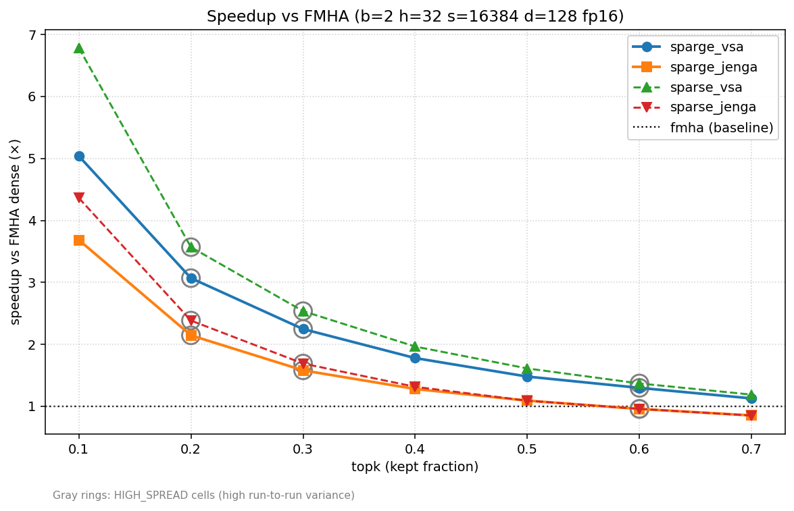
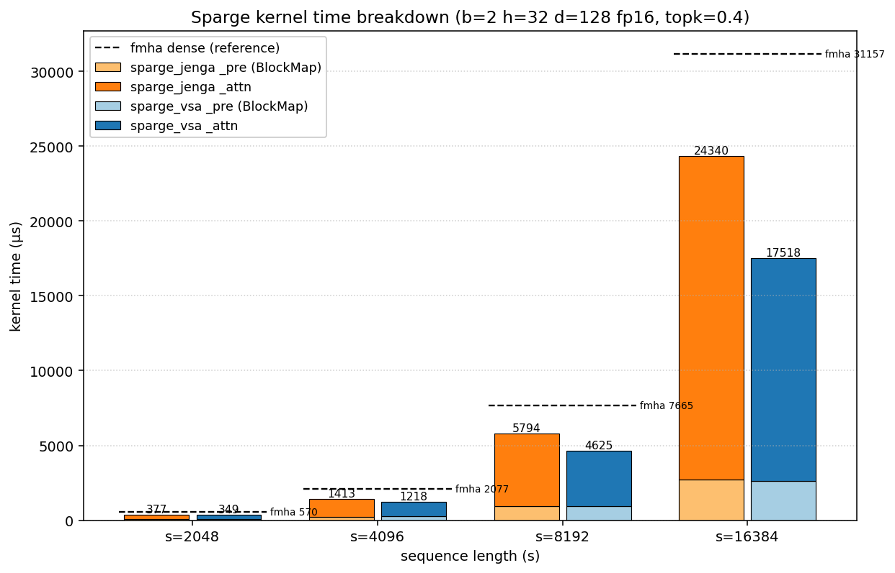

# Sparge Attention (Composable Kernel)

A Composable Kernel port of [SpargeAttn](https://github.com/thu-ml/SpargeAttn) for AMD GPU. Both the block-map pipeline (mean-pool → cosine sim → pooled QK → top-k LUT) and the sparse FMHA stage run on-GPU. Two attention backends are exposed via `-pipeline=vsa` (default, faster) and `-pipeline=jenga` (async K/V load variant).

## Status vs Upstream

Implemented:
- per-block mean-pool, cosine similarity, pooled QK
- top-k / `cdfthreshd` block selection, BlockMap LUT
- sparse FMHA (both `vsa` and `jenga` backends)
- per-head `topk` / `simthreshd1` / `cdfthreshd`

Not yet ported (upstream pinned to commit [`ae5b629`](https://github.com/thu-ml/SpargeAttn/tree/ae5b629ebb41e41f86b3ea2ab5a3283f13ac151a)):
- **K smoothing** — pre-pool `k -= km`; required for diffusion / video checkpoints (CogVideoX, Mochi-1, Flux, OpenSora, SD 3.5) ([spas_sage_attn/core.py:L53](https://github.com/thu-ml/SpargeAttn/blob/ae5b629ebb41e41f86b3ea2ab5a3283f13ac151a/spas_sage_attn/core.py#L53))
- **is_causal mask in pooled score** — required for causal-LM prefill (Llama, Qwen) ([spas_sage_attn/utils.py:L338](https://github.com/thu-ml/SpargeAttn/blob/ae5b629ebb41e41f86b3ea2ab5a3283f13ac151a/spas_sage_attn/utils.py#L338))
- **attention_sink** — column 0 forced ON; upstream is hard-wired to `True` at inference ([spas_sage_attn/autotune.py:L355](https://github.com/thu-ml/SpargeAttn/blob/ae5b629ebb41e41f86b3ea2ab5a3283f13ac151a/spas_sage_attn/autotune.py#L355))
- **pv_threshold per-Q-tile skip in attn kernel** — pure perf, ~5–15% on the dominant attention slice ([spas_sage_attn/core.py:L265](https://github.com/thu-ml/SpargeAttn/blob/ae5b629ebb41e41f86b3ea2ab5a3283f13ac151a/spas_sage_attn/core.py#L265))
- **Sort-based top-k selection** — replaces our O(N_k^2) iterative argmax; matters at long seqlen (s ≥ 16k) ([spas_sage_attn/utils.py:L345](https://github.com/thu-ml/SpargeAttn/blob/ae5b629ebb41e41f86b3ea2ab5a3283f13ac151a/spas_sage_attn/utils.py#L345))
- **Q/K int8 quant fusion in pool kernel** — enables a downstream int8 GEMM0 in the attn kernel ([spas_sage_attn/utils.py:L371](https://github.com/thu-ml/SpargeAttn/blob/ae5b629ebb41e41f86b3ea2ab5a3283f13ac151a/spas_sage_attn/utils.py#L371))

## Performance

At b=2 h=32 s=16384 fp16, sparge (vsa backend) reaches **1.78× FMHA throughput at topk=0.4** and **5.04× at topk=0.1**, and stays above 1.0× across the full topk range.



*Speedup vs FMHA, b=2 h=32 s=16384 d=128 fp16. Shape chosen to match Fig. 10 of the SpargeAttn paper ([arXiv:2502.18137](https://arxiv.org/abs/2502.18137); Mochi-1, 22K context, head_dim=128); s=16384 is the closest grid point. Gray-outlined points have >30% inter-rep spread.*



*BlockMap (`_pre`) stacked on attention (`_attn`), b=2 h=32 d=128 fp16 topk=0.4. BlockMap is roughly 17% of total at s=16384.*

## Usage

```bash
ninja tile_example_sparge
./bin/tile_example_sparge -pipeline=vsa -b=2 -h=32 -s=16384 -d=128 -topk=0.4 -simthreshd1=0.001
```

Add `-v=1` for CPU validation; use a small shape (`-b=1 -h=2 -s=512`), since full-shape CPU reference scales O(s²) and runs 30+ minutes at s=8k, hours at s=16k.

## References

- [SpargeAttn upstream](https://github.com/thu-ml/SpargeAttn) (pinned to [`ae5b629`](https://github.com/thu-ml/SpargeAttn/tree/ae5b629ebb41e41f86b3ea2ab5a3283f13ac151a))
- [Paper — Zhang et al., arXiv:2502.18137](https://arxiv.org/abs/2502.18137)
