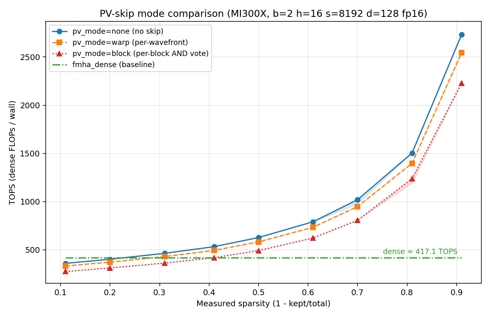

# Sparge Attention (Composable Kernel)

A Composable Kernel port of [SpargeAttn](https://github.com/thu-ml/SpargeAttn) for AMD GPU. Both the block-map pipeline (mean-pool → cosine sim → pooled QK → top-k LUT) and the sparse FMHA stage run on-GPU. Two attention backends are exposed via `-pipeline=vsa` (default, faster) and `-pipeline=jenga` (async K/V load variant).

## Status vs Upstream

Implemented:
- per-block mean-pool, cosine similarity, pooled QK
- top-k / `cdfthreshd` block selection, BlockMap LUT
- sparse FMHA (both `vsa` and `jenga` backends)
- per-head `topk` / `simthreshd1` / `cdfthreshd`
- **is_causal mask in pooled score** (top-left only at block-map grain) ([spas_sage_attn/utils.py:L338](https://github.com/thu-ml/SpargeAttn/blob/ae5b629ebb41e41f86b3ea2ab5a3283f13ac151a/spas_sage_attn/utils.py#L338))
- **attention_sink** — block-map column 0 force-on ([spas_sage_attn/autotune.py:L355](https://github.com/thu-ml/SpargeAttn/blob/ae5b629ebb41e41f86b3ea2ab5a3283f13ac151a/spas_sage_attn/autotune.py#L355))

Not yet ported (upstream pinned to commit [`ae5b629`](https://github.com/thu-ml/SpargeAttn/tree/ae5b629ebb41e41f86b3ea2ab5a3283f13ac151a)):
- **K smoothing** — pre-pool `k -= km`; required for diffusion / video checkpoints (CogVideoX, Mochi-1, Flux, OpenSora, SD 3.5) ([spas_sage_attn/core.py:L53](https://github.com/thu-ml/SpargeAttn/blob/ae5b629ebb41e41f86b3ea2ab5a3283f13ac151a/spas_sage_attn/core.py#L53))
- **Sort-based top-k selection** — replaces our O(N_k^2) iterative argmax; matters at long seqlen (s ≥ 16k) ([spas_sage_attn/utils.py:L345](https://github.com/thu-ml/SpargeAttn/blob/ae5b629ebb41e41f86b3ea2ab5a3283f13ac151a/spas_sage_attn/utils.py#L345))
- **Q/K int8 quant fusion in pool kernel** — enables a downstream int8 GEMM0 in the attn kernel ([spas_sage_attn/utils.py:L371](https://github.com/thu-ml/SpargeAttn/blob/ae5b629ebb41e41f86b3ea2ab5a3283f13ac151a/spas_sage_attn/utils.py#L371))

## PV-skip modes

`pv_threshold` per-Q-tile skip in the attention kernel is implemented in three variants, selectable at runtime via `-pv_mode={none|warp|block}`:

- **`none`** — skip disabled; baseline matching the no-PV-skip codegen instance.
- **`warp`** (per-wavefront) — each wavefront votes locally via `__shfl_xor` butterfly AND; SGPR-resident flag. CK-tile-specific variant, not in upstream.
- **`block`** (per-block) — block-wide consensus vote via LDS broadcast; aligned with upstream sm80 ([`qk_int_sv_f16_cuda_sm80.cuh:L334`](https://github.com/thu-ml/SpargeAttn/blob/ae5b629ebb41e41f86b3ea2ab5a3283f13ac151a/csrc/qattn/qk_int_sv_f16_cuda_sm80.cuh#L334)). V loads stay unconditional in all modes — the guard wraps the PV MMA only, matching upstream and paper Algorithm 1.



*MI300X, b=2 h=16 s=8192 d=128 fp16, 5 seeds × 9 sparsity points. All three modes dispatch to the `kM0=64 padK=0` tile bucket at this shape.*

On the canonical recipe shape, `none > warp > block` at every measured sparsity, with no crossover. The per-block guard adds +33..+35 VGPR (6..9 spills) on this tile configuration, depressing occupancy. `warp` is +0..+4 VGPR. The default is `-pv_mode=warp`; switch to `none` for the no-skip baseline or `block` to exercise the upstream-aligned variant. A shape sweep is needed before recommending `block` as default — the `kM0=128` path has Δ ≈ 0 VGPR for per-block and is a candidate.

## Usage

```bash
ninja tile_example_sparge
./bin/tile_example_sparge -pipeline=vsa -b=2 -h=32 -s=16384 -d=128 -topk=0.4 -simthreshd1=0.001
```

Select a PV-skip variant with `-pv_mode={none|warp|block}` (default `warp`); finite `-pv_threshold=20` lets the per-Q-tile skip predicate fire.

Mask + attention sink:
- `-mask` accepts the `01_fmha` grammar (`0` / `t` / `b` / `t:l,r` / `xt:N` / `g:y,x`, default `0`). The block-map selection prunes past-diagonal blocks only under `mask_top_left` (`t`); `b` / SWA / generic are forwarded to the attention kernel and emit a stderr WARN that the block-map selection is unchanged.
- `-attention_sink {0,1}` forces block-map column `kb=0` ON for every Q-block (default `0`). Under `-mask t` this is degenerate since `kb=0` is always causal-valid.

Add `-v=1` for CPU validation; use a small shape (`-b=1 -h=2 -s=512`), since full-shape CPU reference scales O(s²) and runs 30+ minutes at s=8k, hours at s=16k. When `-mask != 0` or `-attention_sink == 1`, the `[block_map cross-check]` and `[VSA LUT self-consistency]` cells are SKIPPED (the CPU reference does not model causal mask or sink); the `[attention output]` cell still runs but the dense reference applies no mask, so it will report FAIL on the kernel-correct output. Treat `-v=1` correctness as **block-map level only** in those configurations.

## References

- [SpargeAttn upstream](https://github.com/thu-ml/SpargeAttn) (pinned to [`ae5b629`](https://github.com/thu-ml/SpargeAttn/tree/ae5b629ebb41e41f86b3ea2ab5a3283f13ac151a))
- [Paper — Zhang et al., arXiv:2502.18137](https://arxiv.org/abs/2502.18137)
